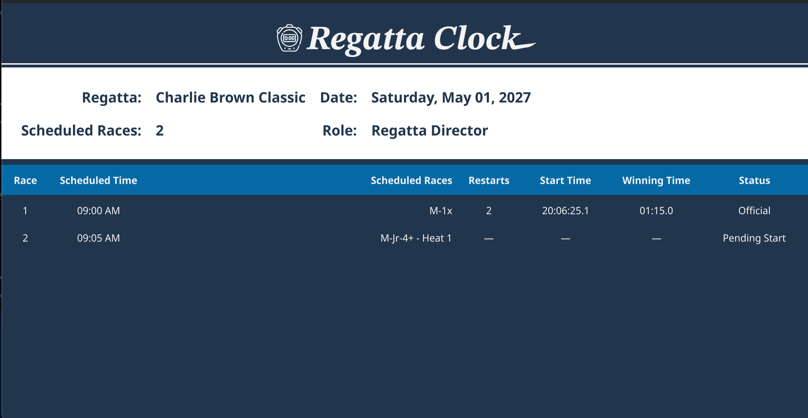
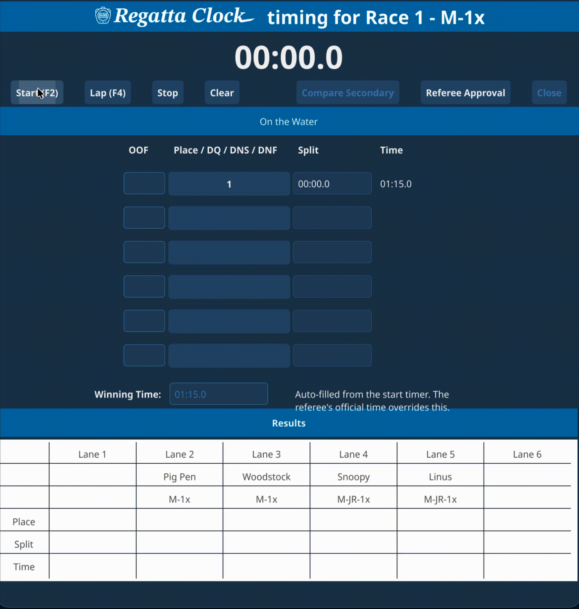
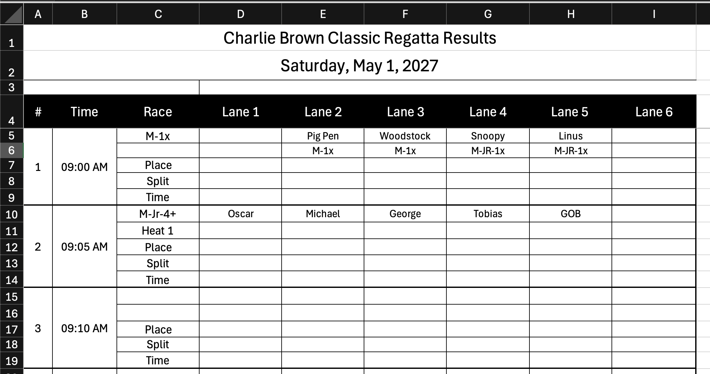
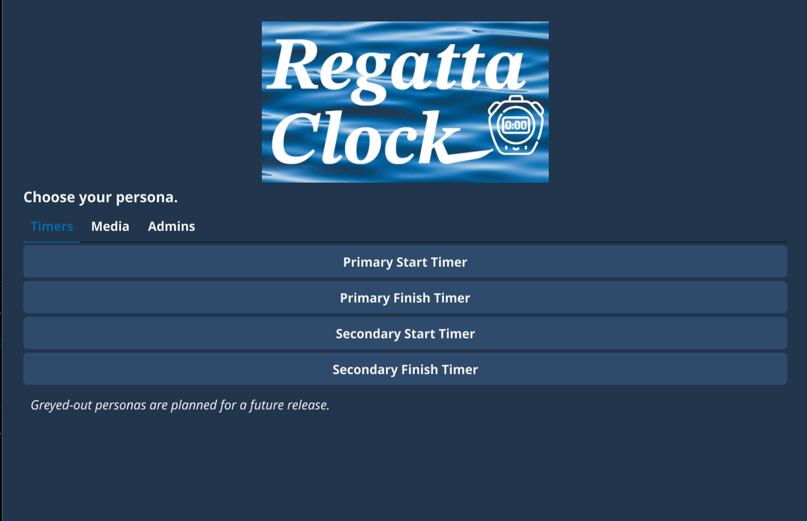
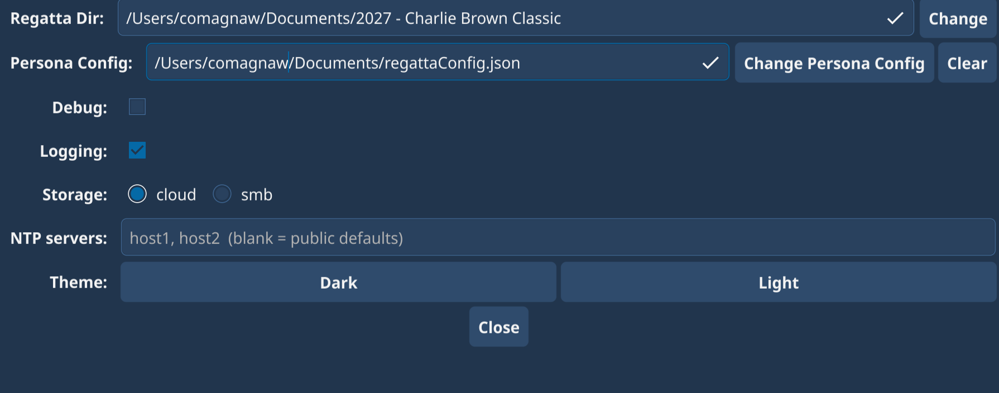

# regattaClock

  

**regattaClock** is an open-source application for collecting and publishing race
times at rowing regattas run by organizations with limited timing infrastructure.
It is written in Go and uses the [fyne.io](https://fyne.io/) toolkit for its user
interface. The project is in alpha: time collection works; results publishing is a
work in progress.

## Why regattaClock exists

Some rowing organizations do not have a cohesive system for capturing start and
finish times across the race course. regattaClock is built for that environment.
It is run at the finish line: operators record when each boat crosses, the referee
provides the official winning time, and the application back-calculates every
boat's time and produces a result that officials can review, approve, and publish.

## How a regatta is run

Several operators share one regatta folder — on a local network share or a
cloud-synced folder — and each runs regattaClock as a single **persona**:

- **Regatta Director** — sets up the shared regatta folder, imports and owns the
  race schedule, watches every team's live progress, and exports lane images. Does
  not time races.
- **Start Timer** — records each race's start time. Runs as a primary operator
  plus an independent **secondary** operator as a backup.
- **Finish Timer** — runs the finish-line clock and enters the referee's winning
  time and the order-of-finish. The **primary** Finish Timer's result becomes the
  official result on **Referee Approval**; the **secondary** Finish Timer keeps an
  unapproved backup used for reconciliation.

Every persona reads the one shared schedule and writes only its own file, so the
teams never overwrite each other's work. Additional personas — for media and
results publishing — are planned.

## The finish-line clock

The Finish Timer opens a race clock and selects **Start** when the first boat
crosses the line, **Lap** as each remaining boat crosses, and **Stop** once the
course is clear. That captures a split for every boat. The operator then enters
the referee's **winning time** (the elapsed time of the first-place boat) and the
**order-of-finish**, placing each lane number in turn. regattaClock calculates
every boat's finish time from the collected splits. The completed race is reviewed
and approved, then published as an official result.

## The race schedule

The schedule input today is an Excel workbook (`.xlsx`, or macro-enabled `.xlsm`),
because the organization regattaClock was first built for organizes its race
information in spreadsheets; a structured or API-based input may come later. The
Regatta Director imports the workbook once into the shared folder; timers read the
shared schedule, never the workbook itself.

A sample workbook is in [examples/](examples/).

## Getting started

1. Each operator opens regattaClock pointed at the shared regatta folder — a
   local network share or a cloud-synced folder (OneDrive, Google Drive).
2. Choose your persona from the picker and enter its **challenge**, a short access
   code. The challenge is either regattaClock's built-in default or a value your
   organization has configured — **confirm it with the Regatta Director or a
   regatta executive before your first session.**
3. Alternatively, an organization can assign a specific computer to a persona by
   hostname. That machine skips the picker and the challenge entirely.
4. The Regatta Director selects the shared folder and imports the schedule; the
   timers confirm the regatta and open their race view. A timer is warned first if
   the regatta's date has already passed.

## Configuration

The Configuration screen — and an optional per-organization deployment file —
cover:

- the shared regatta folder;
- storage mode: local network share or cloud-synced folder;
- an optional persona config file: hostname-to-persona assignment and/or your
  organization's own challenge codes;
- logging and debug output;
- time-sync (NTP) servers;
- light or dark theme.

## Documentation

Design notes live under [docs/features/](docs/features/); the multi-persona model
is in [docs/features/personas/](docs/features/personas/). See
[CONTRIBUTING.md](CONTRIBUTING.md) to build and run from source, and
[AGENTS.md](AGENTS.md) for AI-agent guidance.
