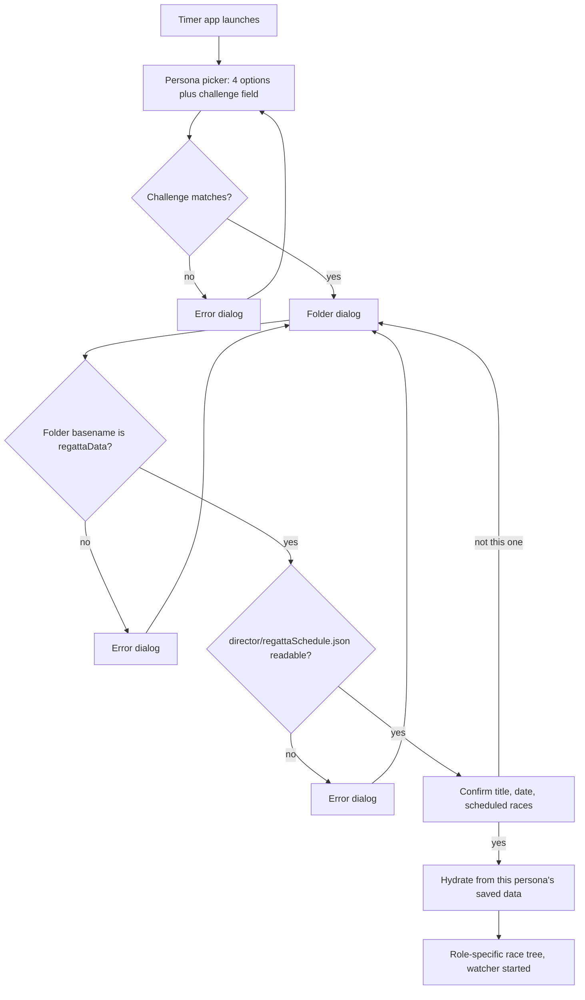

# Persona Implementation Plan

Implementation plan for the persona feature described in [README.md](README.md).

## 1. Decisions made up front

These answers shape everything below.

- **Sharing model: configurable between cloud-synced folder and local SMB.** The preferred race-day path is a spare Windows PC on the venue LAN that shares `regattaData` over SMB and also runs a local NTP service. When course-wide networking is unavailable, fall back to a **cloud-synced local folder**. The app never calls a cloud vendor API — it only reads and writes ordinary paths. `PrefStorageMode` is therefore `cloud` | `smb`, not `onedrive` | `google` | …. OneDrive and Google Drive for Desktop are both consumers of `cloud` mode; switching vendors is an ops change, not a code change. Background on the SMB option lives in [shared-storage-options.md](shared-storage-options.md); storage modes are in sections 6 and 12.
- **File granularity: one file per team + persona.** Every file has exactly one writer. Everyone else opens it read-only. There is no lock contention to manage because there is no shared write target.
- **Timer click path is sacred.** Recording a time from a button click must not block on watchers, schedule diffs, logging, NTP, or disk/cloud I/O. Stated for implementers in the root [README.md](../../../README.md#timer-priority-implementers); apply throughout timer UI and store write-through.
- **Regatta Director: a separate entry point.** Timers get a binary that cannot reach RD functions at all.
- **Event logging is foundational.** Wire `PrefLogging` / `PrefDebug` early via `internal/applog` so every later phase can emit structured JSON logs as it lands, rather than retrofitting call sites at the end. Full design in section 6c; deeper rationale in [logging-options.md](logging-options.md).

## 2. Two problems the requirements do not mention

Both are load-bearing and should be settled before coding starts.

### 2.1 Clock skew between machines is a correctness bug, not an edge case

The requirement in [README.md](README.md) is that the winning time becomes `FT Start click - ST Start Time`. Those two timestamps come from two different laptops. If the ST machine's clock is 3 seconds ahead of the FT machine's, **every race time in the regatta is wrong by 3 seconds**, silently, with no visible symptom. Consumer laptops routinely drift by seconds when they have been asleep or off Wi-Fi.

**Only the cross-machine math is exposed.** Within one machine, lap splits are safe: `getElapsedTime` computes `time.Since(c.clockState.startTime)` where `startTime` came from `time.Now()`, and Go embeds a monotonic reading in both, so `time.Since` is immune to wall-clock jumps. That monotonic reading is stripped the moment a `time.Time` is marshalled to JSON, which is precisely why the ST-to-FT calculation — the only one that crosses a process boundary — is the vulnerable one.

#### Measure the offset; do not set the clock

The instinct is to force a time sync at startup. On Windows that means `w32tm /resync`, and it is the wrong tool here:

- It needs elevation. Setting the system time requires the `SE_SYSTEMTIME_NAME` privilege, so a GUI app would throw a UAC prompt on every launch, and on org-managed devices a standard user often cannot consent to it at all.
- It fails in exactly the conditions we care about. The W32Time service is trigger-start on non-domain Windows and may not be running at all, and on a domain-joined laptop it syncs against the domain controller hierarchy — unreachable from a boathouse on a phone hotspot.
- It destroys the evidence. Setting the clock overwrites the only record of how wrong it was, so a regatta timed with a bad offset can never be corrected afterwards.

Query an NTP server directly from the app instead, in user space, and record the offset without touching the system clock. `github.com/beevik/ntp` is a small pure-Go SNTP client whose `Query` returns `ClockOffset`, `RTT`, and `Stratum` and never modifies system state. It needs no privileges and works identically on Windows and macOS.

This works because **the clocks do not need to be correct, they need to share a time base.** If both machines record `localTime` alongside a measured `offset`, then `trueTime = localTime + offset` and the ST-to-FT difference is accurate even when both system clocks are wrong in different directions.

Design consequences:

- Query at startup and re-query on a ~15 minute ticker, since a laptop waking from sleep can jump. Query two or three servers and take the median to survive one bad responder.
- **Prefer the LAN NTP server when storage mode is `smb`.** The spare Windows PC that hosts the SMB share should also run an NTP service (Windows Time configured as an NTP server, or a lightweight NTP daemon). Point `internal/timesync` at that host first — e.g. `ntp://192.168.x.x` or the share host's hostname — then fall back to public servers (`time.windows.com`, etc.). This is the strongest practical reason to use the spare PC: four laptops synced to the same local reference produce accurate race times even with no internet, because the clocks only need a shared time base.
- **Store the raw local timestamp and the offset as separate fields; never store a pre-corrected time.** Correction is then applied at read time, and a bad offset discovered after the fact can be recomputed away rather than being baked in.
- UDP 123 is commonly blocked on corporate and guest Wi-Fi. When every server fails, record `OffsetSource: "none"` and degrade to detection only: each persona file already carries the writer's wall clock, so a reader can still compare it against its own and raise the skew banner. It cannot correct, but it can warn. Under `smb` mode with a reachable LAN NTP host, this fallback should be rare.
- Optionally offer `w32tm /resync` as an explicitly user-initiated button in the Director's config screen, clearly labelled as requiring admin rights. Never automatic, never at startup.

The remaining mitigations stay as they were:

- Store every timestamp as UTC `RFC3339Nano`.
- Skew over ~1s raises a persistent, dismissible banner naming both machines and the measured offsets.
- Sanity-check the derived winning time. Negative, or outside a plausible race window, means the ST time is bad or stale; suppress the auto-fill and fall back to manual entry.
- **Keep the existing manual `Winning Time` entry as an always-available override.** The referee's official time still wins. The ST-derived value pre-fills the field; it does not replace the field.

### 2.2 Start-time arrival may lag the finish of the race

Under **cloud** mode (OneDrive, Google Drive, or similar), the FT will frequently press `Start` before the ST's start time has synced down. Under **SMB**, latency is typically milliseconds and this becomes uncommon — but it still happens if the ST has not yet clicked, or if the LAN briefly drops.

The clock cannot block on a missing start time either way. Design consequence: the winning time is computed **reactively**. The FT clock shows `waiting for start time...`, and when the watcher delivers the ST record, the winning time and every dependent boat time recompute in place. This also means the FT clock must tolerate a start time arriving for a race that is already stopped, and for a race that is already saved but not yet approved.

## 3. Directory layout and ownership

```
<shared root>/regattaData/
```

The shared root is either a cloud-synced local folder on each laptop (OneDrive, Google Drive for Desktop, etc.) or a UNC path such as `\\timing-pc\regatta\regattaData` served by the spare Windows PC. The tree under `regattaData/` is identical in both modes:

```
regattaData/
├── director/
│   └── regattaSchedule.json   # race program from Excel       [RD writes]
├── timing/
│   ├── primary/
│   │   ├── start.json         # start times                   [Primary ST writes]
│   │   └── finish.json        # race results                  [Primary FT writes]
│   └── secondary/
│       ├── start.json         # start times                   [Secondary ST writes]
│       └── finish.json        # race results                  [Secondary FT writes]
└── logs/
    ├── primary/
    │   └── <role>-<hostname>.log
    ├── secondary/
    │   └── <role>-<hostname>.log
    └── executive/
        └── director-<hostname>.log   # TeamExecutive / RD
```

Ownership, stated as a rule the code enforces rather than a convention:

- **Regatta Director** writes `director/regattaSchedule.json` and nothing else. Reads everything.
- **Primary/Secondary Start Timer** writes only `timing/<team>/start.json`. Reads `director/regattaSchedule.json`.
- **Primary/Secondary Finish Timer** writes only `timing/<team>/finish.json`, which *is* the race results file. Reads `director/regattaSchedule.json` and `timing/<team>/start.json`.

The Director never writes results. Results are produced by the Finish Timer and written when the FT clicks **Referee Approval** or **Save** — both perform the identical write ([README.md](README.md) Finish Timer privileges). The RD is a consumer of results, not a producer: it reads both teams' `finish.json` to reconcile and export.

Two changes to what exists today:

- Today's `regattaData/data.json` becomes `regattaData/director/regattaSchedule.json`. The name is intentional: this file is the race **schedule** (title, date, lanes, flights), not timing results. Rename the constant `common.RegattaDataFile` → `common.RegattaScheduleFile` (`"regattaSchedule.json"`). The RD startup path migrates once: if `regattaData/data.json` or an interim `director/data.json` exists and `director/regattaSchedule.json` does not, move/rename into the new path.
- **The `results/` directory goes away.** `changeCallBack` in [internal/regatta/config.go](internal/regatta/config.go) currently creates `regattaData/results/` and nothing ever writes to it — lane-image export targets a separately chosen folder. With results living in `timing/<team>/finish.json`, that `CreateDirs` call and the `common.ResultsDir` constant should be removed rather than left as a misleading empty directory in everyone's synced folder. The directory creation that replaces it is the RD creating `director/`, and each timer creating its own `timing/<team>/` on first write.

## 3b. Schedule origin refresh (RD only)

Yes — the RD should notice when the **origin** of the schedule changes (lane reassignments, SCRATCHED boats). No — it should **not** silently rewrite `regattaSchedule.json` the moment Excel (or a future API) changes.

### Why not silent auto-apply

- Mid-regatta overwrites can collide with races already started or finished: ST has a start time for a lane that the new sheet scratched; FT has results for a school that moved lanes.
- Excel is a hostile watch target while open: lock files (`~$…`), temp saves, and cloud sync of `.xlsx` produce noisy or partial reads.
- Timing data lives in separate files; blindly replacing the schedule does not update those, so the UI can show a new lane map against old start times unless merge rules are explicit.

### Recommended behaviour: detect → load → compare → prompt only if schedule content changed

An Excel (or API) fingerprint change is a **hint that the origin was touched**, not proof that lane assignments or scratches changed. Workbooks are saved constantly for unrelated edits; rewriting `regattaSchedule.json` in those cases only bumps mtime/sequence and needlessly pokes every timer watcher.

1. **Watch the origin fingerprint cheaply.** For Excel: poll `filesystem.FileHash` (or size+mtime as a weak pre-check, then hash) on a modest interval (e.g. 30–60s). Compare to the last **accepted origin fingerprint** (from `SourceInfo.Hash` on the current schedule, plus an in-memory value updated when a touch was inspected and found to be a no-op).
2. **On fingerprint change: load and normalize, do not write yet.** Re-read the origin through `internal/reader` into a candidate schedule (slim fields only — see [schedule-data-model.md](schedule-data-model.md)).
3. **Compare semantic schedule content** to the in-memory / on-disk `regattaSchedule.json` **excluding** volatile origin metadata if needed. Practical approach: canonical hash (or deep equality) over `Name`, `Date`, and the ordered race/lane school map — not over Excel file bytes and not over `SourceInfo.Hash` alone.
4. **If content is unchanged:** update the RD’s “last inspected origin fingerprint” so the same Excel save does not retrigger forever. **Do not write `regattaSchedule.json`.** No timer disruption. Optionally DEBUG-log “origin touched, schedule unchanged.”
5. **If content changed:** persistent RD banner — “Schedule origin has meaningful changes” — with summary (races/lanes/scratches). RD chooses **Apply** or **Dismiss**.
6. **Apply** writes `regattaSchedule.json` (new content + new `SourceInfo`), refreshes the RD tree; timers then see a real content change via the watcher.
7. **Always keep manual “Reload schedule”** that runs the same load → compare → write-only-if-changed path (or force-write if the RD insists on refreshing `SourceInfo`).

RD Apply already warns when changing races that have timing data. Timers still follow section 3c only when the schedule file’s **payload** actually changes.

### Keep Excel out of the long-term core: origin adapter

`internal/reader` already has a `sourceData` interface used by Excel. Treat schedule ingest as:

```go
// conceptual — lives with reader, not persona/store
type ScheduleOrigin interface {
    // Fingerprint returns a cheap identity for "did the origin change?"
    // Excel: content hash (or size+mtime as a weak pre-check).
    // Future API: ETag / Last-Modified / version field from the response.
    Fingerprint() (string, error)

    // Load returns a full RegattaData snapshot from the origin.
    Load() (*RegattaData, error)
}
```

- **Today:** Excel path + file hash as origin fingerprint (what `ReadExcelFile` / `SourceInfo` already approximate). File hash ≠ schedule content hash.
- **Later:** API origin with URI + API key (prefs or director-only config). Same RD UX: origin fingerprint change → load → **semantic compare** → prompt/Apply only if schedule content differs → `regattaSchedule.json`.
- **`regattaSchedule.json` remains the shared contract** for all personas. Timers never talk to Excel or the API; only the RD’s origin adapter does. That is what keeps a future API pivot from rewriting ST/FT.

Do **not** build the API client in the first persona ship. Do **preserve** `SourceInfo.Type` / `URI` / `Hash` (or generalize Hash → Fingerprint) so the detector works for any origin.

### Scope for phase planning

- Persona ship: RD origin fingerprint poll → load → **semantic schedule compare** → banner/Apply only when content differs; no-op Excel saves must not rewrite `regattaSchedule.json`.
- Later: `ScheduleOrigin` implementation for HTTP API; RD config for endpoint + API key.
- Optional later: “safe merge” that auto-applies only races with no timing data — not required for v1 if Apply is one click.

## 3c. When timers see an updated `regattaSchedule.json`

After the RD Applies, timers receive the new schedule through the existing watcher (they never write the schedule). The hard case is a change to a `RaceNumber` that already has start and/or finish data — typically **SCRATCHED (SCR)** entries or **school ↔ lane** reassignments. Policy: **non-disruptive to collection, impossible to miss when it matters.**

### Hard rules

1. **Never auto-rewrite `start.json` or `finish.json` because the schedule changed.** Timing files stay the SoT for times; schedule stays the SoT for who is in which lane. A silent rewrite would invent or destroy FT OOF/results.
2. **Always refresh the in-memory schedule mirror** and re-render race titles / lane labels from the new schedule (ST and FT).
3. **Diff old schedule vs new by `RaceNumber` (+ lane).** Classify each touched race:
   - *Untimed* — no entry in own start/finish (and for FT, optionally no ST start yet): apply schedule UI silently.
   - *Timed / in progress* — own start exists, or finish exists, or FT clock is open for that race: **attention required**.

### Start Timer (low disruption)

- Race tree labels (school names, scratched lanes, class/flight) update from the new schedule.
- Recorded start times stay keyed by `RaceNumber`; no change to `start.json` unless the ST later clears/restores.
- If a race with a recorded start gains a material lane/school/scratch change: short dismissible notice on that row or a one-line banner (“Schedule updated for race 12 — lane assignments changed”). No modal that blocks the next Start Time click.
- ST does not need to “fix” start times for scratches; a scratched boat does not invalidate the race start clock.

### Finish Timer (higher disruption — OOF / schools)

FT joins schedule lanes to OOF/results by **lane number**. If school in lane 3 changes after results were entered, the times are still for lane 3 but the **label** the official thinks they assigned may be wrong.

When a schedule update touches a race that has finish data, or while that race’s clock window is open:

1. **Banner (not a blocking modal):** “Schedule changed for race N (scratch / lane reassignment). Review results.”
2. **Race tree:** mark the row (e.g. warning affordance) until acknowledged.
3. **Open clock window:** refresh school/additional labels from the new schedule **without clearing** lap rows, OOF, splits, or winning time. Highlight lanes whose `SchoolName` / scratch state changed vs the schedule snapshot used when the clock was opened (or vs last acknowledged schedule).
4. **Persisted `finish.json`:** leave results as-is. Optionally store a `ScheduleFingerprint` or per-race `ScheduleHash` on `RaceResult` at save time so the UI can detect “results were approved against an older lane map” after the fact — nice-to-have, not required for v1 if the in-session diff is enough.
5. **Do not auto-clear OOF** when a lane is scratched in the schedule; prompt the FT to review. Auto-clearing mid-review is more dangerous than a stale label with a warning.

If the FT has **not** yet opened/saved that race, only the tree labels change — same as untimed.

### What timers are *not* asked to do

- Manually edit JSON.
- Re-enter all times because one boat scratched.
- Merge RD schedule into timing files as a background job.

RD Apply already warns when changing races that have timing data (section 3b). Timers add the second line of defense: see the new entries, keep their times, review OOF/labels where FT is exposed.

### Implementation sketch

```text
onScheduleWatcherEvent:
  newSched := unmarshal(regattaSchedule.json)
  changed := diffSchedule(oldSched, newSched)  // by RaceNumber, lane school/additional/scratch
  oldSched = newSched
  refreshAllRaceTreeLabels(newSched)

  for each race in changed:
    if !hasTiming(race) && !clockOpen(race):
      continue  // silent
    notifyScheduleConflict(race, changeKinds)  // banner + row mark; FT stronger copy
```

`hasTiming` = presence in in-memory own start/finish map (and FT may also treat “ST has start” as elevated awareness even before FT save).

### Tests to require

- Untimed race lane change → tree updates, no banner.
- ST has start for race N, school in lane 2 changes → ST row notice, `start.json` unchanged on disk until ST acts.
- FT has saved/approved race N, lane 2 school changes → FT banner + row mark; reopen clock shows new labels, prior OOF/times intact; `finish.json` unchanged until FT Save.
- FT clock open for race N when schedule arrives → labels refresh, times preserved, conflict highlight; no forced close.

**Schedule vs timing ownership is assessed in [schedule-data-model.md](schedule-data-model.md).** In short: `regattaSchedule.json` keeps only regatta meta + `RaceNumber` + class/flight + lane school assignments. `Place` / `Split` / `Time` / `Saved` / `Approved` leave the schedule file; FT owns them in `finish.json`. Join key across files: regatta identity + `RaceNumber`.

New package `internal/persona/store` holding the on-disk types and their read/write functions. Keeping them out of `internal/reader` matters — `reader` is about origin ingestion, and these types are about multi-writer state. Schedule persistence should use a slim schedule type (see schedule-data-model), not the historical “everything in RegattaData” blob.

Two notes on the package layout, since `store` sits under `persona`:

- **`persona` must never import `store`.** Nesting in Go is namespacing only and confers no special access, so these are two ordinary packages and the dependency has to run one way: `store` imports `persona` for the `Role` and `Team` types, and `persona` stays a leaf whose path helpers return plain strings. The easy way to break this later is a convenience method like `func (s Session) LoadStart() (*store.StartLog, error)` hung off `Session`; that one line creates an import cycle and Go will reject the build. Loading and saving belong in `store`, taking a `persona.Session` as an argument.
- **Not `internal/persona/internal/store`.** `internal/clock` needs `FinishLog` and `RaceResult` for saving and rehydration, and `internal/regatta` needs `StartLog` for the race tree. A second `internal` would restrict imports to packages rooted at `persona/` and lock both of them out. The outer `internal/` already caps visibility at this module.

```go
// Envelope wraps every persona-owned file. The header fields exist so a reader
// can reject a file written for a different regatta and can estimate the
// writer's clock offset.
type Envelope struct {
	Version    int          // schema version, for forward compatibility
	Role       persona.Role // "start" | "finish" | "director"
	Team       persona.Team // "primary" | "secondary" | "executive"
	RegattaKey string       // hash of regatta Name+Date from director/regattaSchedule.json
	Machine    string       // hostname, for skew and conflict messages
	WrittenAt  time.Time    // writer's wall clock, UTC RFC3339Nano
	Sequence   int          // monotonic per writer; guards against stale reads

	// Clock - the writer's measured offset from NTP at the time of writing.
	// Stored rather than applied so a bad measurement can be corrected later.
	Clock ClockRef
}

type ClockRef struct {
	Offset     time.Duration // add to a local timestamp to get true time
	RTT        time.Duration // round trip of the NTP query, as a confidence bound
	Source     string        // "ntp:time.windows.com", or "none" when unreachable
	MeasuredAt time.Time     // writer's local clock when the offset was measured
}

type StartLog struct {
	Envelope
	Races map[int]StartRecord // keyed by race number
}

type StartRecord struct {
	RaceNumber int
	StartedAt  *time.Time // nil when never recorded, or currently cleared
	Display    string     // "HH:MM:SS.m" as shown in the ST race tree
	Clock      ClockRef   // offset in force when StartedAt was captured

	// Cleared - every start time the ST has discarded for this race, oldest
	// first. This makes clearing non-destructive: a mistaken clear is restored
	// from the last entry, and the list doubles as an audit trail of restarts.
	Cleared []ClearedStart
}

type ClearedStart struct {
	StartedAt time.Time
	Display   string
	Clock     ClockRef  // the offset in force when this value was captured
	ClearedAt time.Time // writer's local clock when the ST cleared it
}

type FinishLog struct {
	Envelope
	Races map[int]RaceResult
}

// RaceResult carries everything needed to rehydrate the clock window exactly as
// the FT left it, which is required so a restart restores the FT clock.
type RaceResult struct {
	RaceNumber int

	// StartedAt - copy of the ST record actually used, with the ST's offset, so
	// the derived winning time can be recomputed or audited later.
	StartedAt      *time.Time
	StartedAtClock ClockRef

	// FirstFinishAt - the FT's Start click, which in this app marks the first
	// boat crossing the finish line rather than the beginning of the race.
	FirstFinishAt      *time.Time
	FirstFinishClock   ClockRef

	WinningTime string   // referee time; auto-filled but user-editable
	Rows        []LapRow // finish-order rows, mirrors clock.laps
	Approved    bool
	ApprovedAt  *time.Time
	UpdatedAt   time.Time
}

type LapRow struct {
	Lane  int    // OOF lane assignment; 0 = unassigned
	Place string // "1".."6" or DQ / DNF / DNS
	Split string
	Time  string
}
```

`LapRow` is deliberately a one-to-one mirror of the existing in-memory `lapRow` in [internal/clock/laps.go](internal/clock/laps.go), so save and restore are straight field copies rather than a translation layer.

### Why the cleared-start history is a slice and not a map

Keyed by the moment of capture, a map would work — `time.Time` implements `TextMarshaler` and `TextUnmarshaler`, so `map[time.Time]T` does round-trip through JSON. The problem is that the feature is inherently ordered. "Restore the time I just cleared by mistake" means *the most recent* entry, and a Go map has no order, so every restore would have to sort the keys first. A slice appended oldest-first gives you `Cleared[len(Cleared)-1]` directly and makes the restart sequence (record, clear, record, clear) readable in the file exactly as it happened.

The key and the value would also be near-duplicates: for a start time, the moment of capture *is* the value. `ClearedAt` is the genuinely new piece of information, so it belongs as a field rather than a key.

Cap the slice at ten entries per race. A race restarting more than a handful of times is not a scenario worth unbounded file growth.

### A correction this exposed: `ClockRef` belongs on the record, not only the envelope

Adding a per-entry `Clock` to `ClearedStart` surfaced a bug in the earlier design. `Envelope.Clock` describes the offset measured at *write* time, but `internal/timesync` re-queries every fifteen minutes and the file is rewritten on every change, so by the time a start time is read back the envelope's offset may no longer be the one that was in force when the value was captured. Each captured timestamp therefore carries its own `ClockRef`. The envelope keeps its copy for diagnostics — it is what the skew banner compares against — but correctness comes from the per-record value.

### On the "as performant as possible" requirement

Keep JSON. At regatta scale — on the order of 100 races — a `finish.json` is tens of kilobytes and marshals in microseconds. Under cloud sync the cost that actually matters is sync propagation measured in seconds; under SMB it is network RTT. Either way, switching to gob or protobuf would optimize the wrong end while giving up the ability to inspect and hand-repair a file mid-regatta. What *does* matter for the watching goroutine is not re-parsing unnecessarily, which section 6 handles with a content-hash short circuit.

## 5. Safe writing

Add to [internal/filesystem/file.go](internal/filesystem/file.go):

```go
// SaveJSONFileAtomic writes to a sibling temp file, fsyncs, then renames over
// the target. A reader mid-update sees either the old file or the new one, never
// a half-written one. The rename is retried: on Windows, cloud sync clients,
// Defender, and SMB all take transient handles on files they have just noticed change.
func SaveJSONFileAtomic(data any, filename string) error
```

Sequence: marshal, write `<dir>/<name>.tmp`, `Sync()`, `Close()`, `os.Rename` over the target. The temp file is a sibling because rename is only atomic within one filesystem; it is short-lived, and the watcher ignores any filename that is not an exact expected match. Prefer UNC paths (`\\host\share\...`) over mapped drive letters for SMB — drive letters are per-user and often fail to reconnect after sleep.

**The rename needs a retry loop in both storage modes.** `os.Rename` on Windows is `MoveFileEx` with `MOVEFILE_REPLACE_EXISTING`. Under cloud sync it fails when the client is mid-upload; under SMB it fails when another client or Defender holds a handle. Both surface as `ERROR_SHARING_VIOLATION` (32) or `ERROR_ACCESS_DENIED` (5). Treat both as retryable — roughly five attempts with backoff from 50ms — and only surface an error after they are exhausted.

**Conflict copies are a cloud-sync phenomenon.** Sync clients resolve simultaneous writes by creating a sibling file rather than merging (OneDrive: `start-DESKTOP-A1B2C3.json`; Google Drive often uses names like `start (1).json` or conflict copies with the machine/user in the name). SMB produces a sharing violation instead. Conflict-copy *detection* therefore runs only in `cloud` mode, using a **vendor-agnostic heuristic**: any file in the timing directory whose stem matches an expected name (`start`, `finish`) but is not exactly `start.json` / `finish.json`. Do not hard-code OneDrive naming alone. The single-writer-per-file model still applies in both modes.

## 5b. Timer session state: memory is the working set, file is the durable full map

This was under-specified earlier. Clarify it as a hard rule for ST and FT.

### What “save race N” must mean

Each persona owns **one** timing file (`start.json` or `finish.json`) whose payload is the **entire** `Races map[int]…` for the regatta — not one file per race, and not a write that contains only the race just updated.

When the ST records (or clears/restores) race 12:

1. Update **only** `log.Races[12]` in the in-memory `StartLog`.
2. Atomically write the **whole** `StartLog` (every race already collected, plus 12) via `SaveJSONFileAtomic`.
3. Bump `Envelope.Sequence` / `WrittenAt` on that full write.

Same pattern for FT Save / Referee Approval on `FinishLog`.

**Forbidden:** constructing a new `StartLog`/`FinishLog` that contains solely `{12: …}` and replacing the file with that. That would erase every other race’s times. Tests must cover “save race 5 then save race 6 → file still contains both.”

The file *is* fully rewritten on each save (atomic replace of the whole JSON document). That is intentional and cheap at regatta scale. What must not happen is a rewrite whose **payload** is a partial map.

### In-memory vs on-disk: which is primary?

| Role of data | Primary during a live session | Role of the file |
|--------------|-------------------------------|------------------|
| **Own** timing log (ST→`start.json`, FT→`finish.json`) | **In-memory** `StartLog` / `FinishLog` held on the session for the whole app run | Durable snapshot; write-through after each mutation; hydrate **once** at startup |
| **Others’** files (e.g. FT reading ST `start.json`; RD reading all four) | In-memory mirror updated by the **watcher** (and by the initial hydrate) | Source of truth for peers; this persona never writes them |

So:

- The timer does **not** re-read its own file before each save to learn prior races — that would race the watcher and invite empty-map bugs. Memory already has the full map from hydrate + prior clicks.
- The timer does **not** treat the file as the only place times live while the UI is up — the race tree binds to the in-memory log (and to schedule + watched peer data).
- On restart, the file **is** the source of truth again: hydrate into memory, then continue write-through.

```text
startup:  read own file → memory (full map)
          read schedule + peer files → memory mirrors
click:    memory[RaceNumber] = …  →  atomic write(full memory map)
peer:     watcher → update peer mirror in memory → refresh UI rows
```

Parse failure of the own file still blocks writes (section 8): never replace a corrupt full history with a fresh one-race map.

New package `internal/watcher`. The directory layout and event shape are the same for both storage modes; the **detection strategy** is selected by configuration.

```go
type Mode string

const (
	ModeCloud Mode = "cloud" // poll with stat-then-hash (vendor-synced local folder)
	ModeSMB   Mode = "smb"   // prefer notify; fall back to poll
)

type Event struct {
	Path string
	Data []byte
}

func New(mode Mode, interval time.Duration) *Watcher
func (w *Watcher) Add(path string)
func (w *Watcher) Start(ctx context.Context) <-chan Event
func (w *Watcher) Stop()
```

### Strategy by storage mode

| Mode | Default strategy | Why |
|------|------------------|-----|
| `cloud` | Poll (~2s), stat-then-hash | Cloud clients (OneDrive, Google Drive for Desktop, etc.) apply remote changes through staging / placeholder hydration; fsnotify either misses content changes or fires on hydration noise. |
| `smb` | Prefer `fsnotify` (`ReadDirectoryChangesW` over SMB2), fall back to poll | SMB2 can push change notifications and bypasses the Windows SMB client metadata cache that would otherwise make a fast poll see stale `ModTime` for ~10s. |

The watcher interface is one package; mode selects the backend. Poll remains the universal fallback if notify fails to start or the path is not a real SMB share. **There is no per-vendor cloud backend** — Google Drive and OneDrive both use `ModeCloud`.

### Polling details (required for cloud, fallback for SMB)

Per watched file: `os.Stat`, compare `ModTime` and `Size` against the last observation; only if those differ, read the file and compare a SHA-256 of the contents; only if the hash differs, unmarshal and emit.

- **Compare `ModTime` for inequality, not for ordering.** Cloud sync often preserves the writing machine's modification timestamp, so an update can arrive with an *older* mtime. Under SMB this is less common but the same rule is safe.
- **`os.Stat` is often safe on a Files On-Demand / streaming placeholder; `os.ReadFile` may trigger hydration.** Reading a dehydrated placeholder can block or fail offline. Guard against overlapping ticks; treat read failure as "no change" plus a warning.
- Ignore anything that is not an exact expected filename — our `.tmp` files, conflict-copy near-misses, `desktop.ini`, and everything under `logs/` (section 6c).

### SMB-specific detail

The Windows SMB client caches directory metadata (`FileInfoCacheLifetime` / `DirectoryCacheLifetime`, default ~10s). A poller faster than that cache can miss updates. Prefer notify under `smb` mode rather than asking every laptop to zero those registry values. If notify is unavailable, use a poll interval at least as long as the cache lifetime, still with the hash check as source of truth.

### UI delivery

Delivery into the UI goes through `fyne.Do`, matching the pattern the clock goroutine already uses:

```117:140:internal/clock/clock.go
// startClockUpdate - go routine which displays a running clock once the start button
// is pushed.
func (c *Clock) startClockUpdate() {
	ticker := time.NewTicker(100 * time.Millisecond) // Update every 0.1 seconds
	defer ticker.Stop()

	for {
		select {
		case <-ticker.C:
			if c.clockState.isRunning {
				formatted := c.getElapsedTime()
				// Use fyne.Do to update UI on the main thread
				fyne.Do(func() {
					if c.clock != nil { // Add nil check for safety
						c.clock.Text = formatted
						c.clock.Refresh()
					}
				})
			}
		case <-c.clockState.stopChan:
			return
		}
	}
}
```

The watcher's lifetime is the app session, not a window, so it takes a `context.Context` cancelled at shutdown rather than the clock's `stopChan` pattern.

## 6b. Storage mode configuration

Add a Fyne preference (and a control on the Director/timer config screen) for the shared-storage mode:

| Preference | Values | Effect |
|------------|--------|--------|
| `PrefStorageMode` | `cloud` (default) / `smb` | Selects watcher backend and whether conflict-copy scanning runs |
| `PrefNTPServers` | comma-separated hosts | Overrides the default NTP list; under `smb`, seed with the share host so LAN NTP is tried first |

### Vendor scope (intentional limit)

The store layer is **filesystem-only**. It does not integrate with Microsoft Graph, Google Drive API, Dropbox API, or any other cloud SDK.

- **In scope for `cloud` mode:** any client that mirrors a folder onto the local disk as a normal path (explicitly including **OneDrive** and **Google Drive for Desktop**). Moving the organization from OneDrive to Google Drive means pointing at the new local folder and keeping `PrefStorageMode=cloud`.
- **In scope for `smb` mode:** a LAN share (spare PC / NAS).
- **Out of scope:** first-class support for every sync product under the sun, vendor-specific APIs, or a plugin interface per cloud provider. A generic `cloud` vs `smb` strategy interface inside `internal/watcher` is enough; do not invent a third mode per vendor.

The folder dialog and path validation stay mode-agnostic: the user still picks (or pastes) the `regattaData` root, whether that is a synced cloud path or a UNC path. Mode is about *how the app watches and syncs time*, not about which logo is on the sync client.

Recommended race-day setup for the spare PC (documented in README, not enforced by code):

1. Share a folder over SMB (prefer UNC: `\\timing-pc\regatta\regattaData`).
2. Pin/keep the share host awake; do not rely on a mapped drive letter on timer laptops.
3. Enable NTP on that PC and put its address in `PrefNTPServers`.
4. Optionally one-way backup the share to cloud storage from the host PC for off-site recovery — never bidirectional into the live tree mid-regatta.

## 6c. Event logging (foundational)

Adopted from [logging-options.md](logging-options.md). Logging is **not** a late polish item: if it lands after the race tree and clock, every call site has to be revisited. Put `internal/applog` in immediately after filesystem foundations so timesync, watcher, startup, race tree, and clock can log as they are written.

### Preferences → severity

Reuse the existing config checkboxes in [internal/regatta/config.go](internal/regatta/config.go). Nothing reads them yet.

| Preferences | Handler level | Written |
|-------------|---------------|---------|
| Logging off | discard | nothing (Debug alone does not open a file) |
| Logging on, Debug off | `INFO` | INFO, WARN, ERROR |
| Logging on, Debug on | `DEBUG` | DEBUG + above |

### Implementation

- Package **`internal/applog`**: `slog.JSONHandler`, async append writer (never block Start/Lap on disk), best-effort on write failure.
- Path: **`regattaData/logs/<team>/<role>-<hostname>.log`** (RD: `logs/executive/director-<hostname>.log`). Hostname in the filename *and* as JSON field `machine`.
- Fixed attrs on every line via `logger.With`: `persona`, `team`, `role`, `machine` (plus `regatta_key`, `storage_mode` when known).
- **INFO** — button clicks, NTP measure success, watcher content changes, hydrate/save success, challenge/directory confirm.
- **WARN** — large NTP offset, NTP `none`, conflict copy, non-fatal read issues.
- **ERROR** — any failure already shown in UI or returned as `error` (same `err` in the log line).
- **DEBUG** — poll heartbeats / verbose internals only when both prefs allow.
- Watcher **must ignore `logs/`** (exact-filename allowlist for timing files already required).
- Before `regattaData` is known: ring-buffer early events in memory; flush after `SetOutput`.

Later phases do not re-open the logging design — they only add `applog.Info` / `Error` / etc. at the relevant call sites.

## 7. The persona registry

New package `internal/persona`. The registry is a single slice so that future personas can be added later ([README.md](README.md)) by appending one struct literal.

```go
type Role string
type Team string

const (
	RoleDirector Role = "director"
	RoleStart    Role = "start"
	RoleFinish   Role = "finish"

	TeamExecutive Team = "executive" // RD (and any future non-timing officials)
	TeamPrimary   Team = "primary"
	TeamSecondary Team = "secondary"
)

type Definition struct {
	ID        string // "pst", "sst", "pft", "sft", "rd"
	Role      Role
	Team      Team
	Label     string // "Primary Start Timer"
	Challenge string // "rc-pst"
	File      string // "start.json"; empty for director schedule ownership
}

// Registry - personas offered on the timer startup screen, in display order.
var Registry = []Definition{
	{ID: "pst", Role: RoleStart, Team: TeamPrimary, Label: "Primary Start Timer", Challenge: "rc-pst", File: "start.json"},
	{ID: "sst", Role: RoleStart, Team: TeamSecondary, Label: "Secondary Start Timer", Challenge: "rc-sst", File: "start.json"},
	{ID: "pft", Role: RoleFinish, Team: TeamPrimary, Label: "Primary Finish Timer", Challenge: "rc-pft", File: "finish.json"},
	{ID: "sft", Role: RoleFinish, Team: TeamSecondary, Label: "Secondary Finish Timer", Challenge: "rc-sft", File: "finish.json"},
}

// DirectorDefinition - used by the separate director binary; not offered on the timer picker.
var DirectorDefinition = Definition{
	ID: "rd", Role: RoleDirector, Team: TeamExecutive, Label: "Regatta Director", Challenge: "rc-rd", File: "",
}
```

There is no empty/`TeamNone` team. The RD belongs to **`TeamExecutive`**, which is reserved for non-timing official personas (today only the Director; easy to extend later without inventing a second "no team" sentinel).

Challenge codes are constants in source for now ([README.md](README.md)). Comparison is trimmed and case-insensitive.

A `Session` value is created once at startup and threaded through `Regatta` and `Clock` instead of being consulted from globals:

```go
type Session struct {
	Definition
	Root string // absolute path to the chosen regattaData directory
}

func (s Session) WritePath() string  // regattaData/timing/<team>/<file>
func (s Session) StartPath() string  // regattaData/timing/<team>/start.json
func (s Session) SchedulePath() string // regattaData/director/regattaSchedule.json
```

## 8. Startup flow



### Restoring a persona's view on restart

**Every timer persona hydrates its race tree from what is already saved in `regattaData` before the tree is first shown.** A Start Timer who has to restart the app mid-regatta comes back to every start time they had already collected; a Finish Timer comes back to the start times the ST has recorded *and* to their own saved results. Nothing collected before the restart is lost from view, and nothing has to be re-entered.

What each persona reads at this point:

- **Start Timer** reads its own `timing/<team>/start.json`. Every race with a `StartedAt` shows its time; every race with a non-empty `Cleared` history shows the `Restore` button.
- **Finish Timer** reads both `timing/<team>/start.json`, for the start-time value on each row, and its own `timing/<team>/finish.json`, for the races it has already timed. Combined with the per-race clock rehydration in section 9, reopening any race returns the FT to exactly the state they left it.
- **Director** reads `director/regattaSchedule.json` plus all four timing files, as described in section 9.

**Hydration and the watcher share one code path.** The initial load is nothing more than "apply the current contents of these files through the same row-update function the watcher calls." Writing a separate startup render would give two code paths that have to agree about how a race row looks, and they would eventually drift.

Four things this load has to get right:

- **Reject data from a different regatta.** A timer who used the app at last weekend's regatta still has a `start.json` on disk. The `Envelope.RegattaKey` is compared against the regatta in `director/regattaSchedule.json`, and on a mismatch the file is not hydrated and not overwritten — it is renamed aside with a timestamp and the persona starts clean, with an explanation. Silently showing last week's times against this week's races is the kind of error nobody catches until results are published.
- **Resume the sequence counter.** `Envelope.Sequence` continues from the value in the file rather than restarting at zero, or the stale-read guard stops working for the rest of the day.
- **A missing file is normal, not an error.** First launch at a given regatta has nothing to restore. This matches how `initRegatta` already treats `fs.ErrNotExist` today.
- **Never overwrite a file that failed to parse.** This is the one that can lose a day's work. If the persona's own file exists but does not unmarshal, the app must not fall back to an empty in-memory state and then write it out on the next Start Time click. Treat a parse failure as fatal for that persona: report it, copy the file aside for recovery, and require the user to acknowledge before any write is permitted.

Three notes on fidelity to the requirements:

- **Directory named `regattaData`.** [README.md](README.md) asks that timers only open a matching directory. Fyne's `ShowFolderOpen` has no filter hook and no way to conditionally disable its Open button, so this is implemented as validate-in-callback plus immediate re-prompt with an explanatory error. Behaviourally equivalent, one extra click in the failure case. Flagging it because it is a deliberate deviation from the literal wording.
- **The folder name alone is not a reliable check.** Under cloud clients, shared folders are often added as shortcuts and renamed (OneDrive "Add shortcut to My files", Google Drive shared-drive shortcuts, etc.). Under SMB, the share may be mounted or browsed under any leaf name. Validate on *either* a basename of `regattaData` or the presence of a readable `director/regattaSchedule.json` inside the selected folder, and accept the folder if either holds. Accept UNC paths. The confirmation dialog in the next step is the real safeguard against picking the wrong regatta.
- **Preferences no longer drive startup.** `initRegatta` currently restores the last session from `PrefRegattaDir`:

```130:150:internal/regatta/regatta.go
func (r *Regatta) initRegatta() {

	if r.App.Preferences().String(common.PrefRegattaDir) == common.EmptyString {
		r.showWelcome()
		return
	}

	if err := r.loadRegattaData(); err != nil {
		// A missing file is the normal first run for a configured directory: the
		// user has chosen where their data lives but has not imported a regatta.
		if !errors.Is(err, fs.ErrNotExist) {
			r.warnOnStarted(err)
		}
		r.loadState.loadButton.Enable()
		r.showWelcome()
		return
	}

	r.refreshContent()
	r.showRaceTree()
}
```

  For the timer binary this is replaced entirely by the persona flow. `PrefRegattaDir` is no longer read to auto-load; at most it seeds the folder dialog's starting location as a convenience. The RD binary keeps it, since the RD is the persona that "establishes the regattaData save location".
- **`setupStartupDialog` at [internal/regatta/regatta.go](internal/regatta/regatta.go) lines 103-128 is dead code** and should be deleted as part of this work rather than carried forward.

### Regatta Director entry point

A second binary, `cmd/regattaDirector/main.go`, sharing `internal/regatta` via a mode flag on construction (`NewDirector` / `NewTimer`). The timer binary contains no path to the Excel loader, so timers cannot reach RD functions even accidentally. [.github/workflows/release.yml](.github/workflows/release.yml) gains parallel `fyne package -src ./cmd/regattaDirector/` steps for macOS and Windows.

Lower-effort alternative if two distributables prove annoying: one binary with a `--director` flag. Same code structure, weaker separation.

## 9. UI changes by role

### Race tree

The current row is title, spacer, `Time Race` button:

```81:98:internal/regatta/races.go
func (r *Regatta) timeButton(race reader.RaceData) *widget.Button {
	// Create a button to time this race
	return widget.NewButton(common.TimeRaceButtonText, func(raceData reader.RaceData) func() {
		return func() {
			clockApp := clock.NewClock(r.App, r.RegattaData, raceData)
			clockApp.OpenRaceClock()

		}
	}(race))
}

func (r *Regatta) raceEntry(race reader.RaceData) *fyne.Container {
	return container.NewHBox(
		widget.NewLabel(race.RaceTitle()),
		layout.NewSpacer(),
		r.timeButton(race),
	)
}
```

It becomes role-driven:

- **Start Timer**: title, start-time label, `Start Time` button, `Clear` button, and a `Restore` button. No `Time Race` button. `Clear` still prompts for confirmation ([README.md](README.md)), and recording, clearing, and restoring each write `start.json` immediately.

  **Clearing is non-destructive.** Rather than wiping the value, `Clear` appends it to that race's `Cleared` history and sets `StartedAt` to nil. `Restore` pops the most recent entry back into `StartedAt`, along with the `ClockRef` that was in force when it was originally captured — restoring the value without its original offset would reintroduce exactly the skew error section 2.1 exists to prevent.

  `Restore` is visible only when the race has a non-empty `Cleared` history. In the common case — the ST clears by mistake and the row goes blank — it simply appears next to `Start Time`, needing no menu. If a new time has since been recorded, restoring would overwrite good data, so that case prompts for confirmation the way `Clear` does.

  This changes nothing for the Finish Timer, which reads only `StartedAt` and recomputes reactively when the watcher reports the change. A clear followed by a restore looks to the FT like any other update.
- **Finish Timer**: title, start-time label (read-only, watcher-updated), an indicator of the FT's own saved progress for that race, and the `Time Race` button. No `Start Time` button. As schedule updates arrive, refresh labels; if the race already has finish data or an open clock, show a non-blocking conflict banner (section 3c) — never auto-edit `finish.json` for scratches/lane moves.

  The progress indicator exists so the restart case in section 8 actually restores something visible: an FT returning after a crash needs to see at a glance which races they have already timed and approved, not just which ones have start times. It reads `WinningTime` and `Approved` from their own `finish.json`.
- **Director**: read-only. No buttons on any row. Each row carries the race title plus four values that together show how far the regatta has progressed: **Restarts**, **Start Time**, **Winning Time**, and an **approval indicator**.

  Sources are `len(StartRecord.Cleared)` for restarts, `StartRecord.Display` for the start time, and `RaceResult.WinningTime` and `RaceResult.Approved` from the finish log.

  **Primary team first, falling back to secondary per value.** The fallback is per value rather than per row, because the failure modes are independent: the primary ST can be recording while the primary FT's machine is offline, which should show a primary start time next to a secondary winning time rather than dropping the whole row to secondary. Any value sourced from the secondary team is marked as such — an RD who reads a secondary time as though it were primary has been given worse information than a blank cell.

  This makes the Director the one person who can see the regatta stalling, so it is where the staleness indicator and the clock-skew banner from section 2.1 matter most.

  Two consequences worth noting. The RD no longer times races at all — dropping the row buttons removes the `Time Race` path from the Director, leaving Excel import and lane-image export in the menus as its only actions. And **the Director now needs the watcher**, which the earlier draft scoped to timers only; it watches all four timing files, since per-value fallback requires the secondary team's data even when the primary is healthy.

`showRaceTree` currently rebuilds the entire window content. Rebuilding on every watcher tick would throw away the user's scroll position mid-regatta, so the tree keeps a `map[int]*raceRow` of per-race widget handles and updates the affected labels in place inside `fyne.Do`.

### Finish Timer clock

Three changes to [internal/clock](internal/clock):

1. **Auto-filled winning time.** On `Start`, look up the ST record for this race. If present and sane, pre-fill `winningTime` with `ClockStart - StartedAt` and mark it as derived; the field stays editable. If absent, show `waiting for start time...` and recompute when the watcher delivers it. The existing `Time = Split + WinningTime` math in `adjustTime` is unchanged — only the source of `WinningTime` changes.
2. **Save on approve and on Save.** `refereeApprovalFunc` currently only flips an in-memory flag, and `initSave` is a stub that does nothing:

```181:189:internal/clock/buttons.go
func (c *Clock) initSave() *widget.Button {
	button := widget.NewButton(common.SaveButtonText, func() {
		// Save logic will be implemented later
	})
	button.Disable()
	return button
}
```

   Both now serialize the lap rows into a `RaceResult` and atomically rewrite `finish.json` ([README.md](README.md) FT privileges).
3. **Rehydration.** `NewClock` checks `finish.json` for an existing `RaceResult` for this race number and, if found, restores lap rows, OOF assignments, place overrides, winning time, and button enablement before showing the window ([README.md](README.md)).

## 10. Suggested phasing

Each phase compiles, passes tests, and leaves the app usable.

0. **Windows CI first.** Add the `windows-latest` job to [.github/workflows/test.yml](.github/workflows/test.yml) before anything else, so that every phase after it is verified on the platform it will actually run on.
1. **Foundations** — `SaveJSONFileAtomic` with its retry loop, hash helper, `sanitizeForFilename`. No UI change.
1a. **`internal/applog` (foundational)** — wire `PrefLogging` / `PrefDebug` to `slog.JSONHandler` + async file writer; identity attrs API; no-op when Logging off. Lands *before* timesync/watcher/UI so those phases log as they are built rather than in a retrofit pass. Detail in section 6c and [logging-options.md](logging-options.md).
1b. **`internal/timesync`** — SNTP offset measurement via `github.com/beevik/ntp`, configurable server list (LAN NTP first under `smb` mode), median of several servers, background re-query, and a `Now()` returning the corrected time plus its `ClockRef`. Emit INFO/WARN/ERROR via `applog`.
2. **Persona registry** — `internal/persona` with the registry (`TeamExecutive` for RD), challenge check, and path helpers. Pure logic, fully unit-testable.
3. **Layout and store types** — `internal/persona/store` types; slim `regattaSchedule.json` per [schedule-data-model.md](schedule-data-model.md); migration from `data.json`; log hydrate/write success and ERROR on failure.
4. **Watcher** — `internal/watcher` with mode-selected backends (`cloud` poll vs `smb` notify-with-poll-fallback), vendor-agnostic conflict-copy detection only in cloud mode; ignore `logs/`; log content changes at INFO.
4b. **Storage mode preferences** — `PrefStorageMode` (`cloud` \| `smb`) and `PrefNTPServers` on the config screen; wire them into watcher construction and timesync.
5. **Timer startup flow** — picker, challenge, directory validation, confirmation, hydration; `applog.SetOutput` + `SetIdentity` once session root is known. Delete `setupStartupDialog`.
6. **Role-aware race tree** — Start Time / Clear / Restore for ST, progress indicators for FT and RD, in-place watcher refresh; log button actions at INFO.
7. **Clock integration** — derived winning time, save on approve/save, rehydration, skew warnings; log clock actions and ERROR on save failure; schedule-conflict label refresh while clock open (section 3c).
8. **Director binary** — `cmd/regattaDirector`, read-only progress tree, **schedule origin fingerprint poll + Apply/Reload** (section 3b), release packaging, and primary-vs-secondary reconciliation for export; executive-team log path. Timer-side schedule-diff notices (section 3c) ship with race tree / clock phases 6–7.

## 11. Testing

The existing suites in `internal/regatta` and `internal/clock` already construct real Fyne test apps, so the new work fits the same pattern.

- **Registry** — every persona has a unique challenge and a unique write path; challenge matching is case- and whitespace-insensitive.
- **Atomic write** — concurrent reader never observes partial content; rename replaces an existing file on the host platform; and, in a Windows-only test, a rename whose target is held open by another handle succeeds once that handle closes rather than failing on the first attempt.
- **Full-map write-through** — after hydrate with races {1,2}, saving race 3 leaves {1,2,3} on disk; a save must never replace the file with a single-race payload. In-memory log is the session working set; own file is not re-read before each save.
- **Schedule origin no-op** — Excel file hash changes but normalized Name/Date/races/lanes are equal → `regattaSchedule.json` is not rewritten and timer watchers are not notified.
- **Filename sanitization** — regatta names containing Windows-reserved characters and reserved device names produce writable paths.
- **Clear and restore** — a record, clear, record, clear sequence leaves the history in capture order; `Restore` returns the most recently cleared value *and* its original `ClockRef` rather than the current one; the history caps at ten entries by dropping the oldest; and restoring onto a race that already has a start time requires confirmation.
- **Director progress tree** — restarts reflect `len(Cleared)`; a race present only in the secondary team's data falls back and is marked as secondary-sourced; and fallback is per value, so a primary start time and a secondary winning time can appear on the same row.
- **Skew and winning time** — derived winning time is correct for aligned clocks, and suppressed with a warning for negative or implausible values.
- **Watcher** — a file rewritten with identical content emits nothing; changed content emits once; mtime granularity does not cause missed updates; a replacement file stamped with an *older* mtime is still detected (cloud sync case); and under `smb` mode the notify backend delivers an update that a short-interval poll alone would miss behind a warm SMB metadata cache.
- **Storage mode** — switching `PrefStorageMode` selects the watcher backend; conflict-copy scanning runs only for `cloud` (heuristic, not OneDrive-named-only); `PrefNTPServers` seeds timesync with the LAN host under `smb`.
- **Time sync** — two synthetic personas with system clocks offset in opposite directions produce the correct winning time once their recorded offsets are applied. An unreachable NTP server yields `Source: "none"` and a warning. A configured LAN NTP server is preferred over public servers when present.
- **Round trip** — a fully timed race saved to `finish.json` and rehydrated into a fresh clock reproduces every lap row, place override, and OOF assignment.
- **Startup flow** — wrong challenge returns to the picker; a directory not named `regattaData` is rejected; declining the confirmation returns to the folder dialog.
- **Restart restores the view** — an ST with saved start times and cleared history sees both after a restart; an FT sees the ST's times plus its own approvals; a `start.json` whose `RegattaKey` belongs to another regatta is set aside rather than displayed; `Sequence` resumes from the file rather than resetting; and a persona file that fails to unmarshal blocks writes instead of being silently replaced with an empty one.
- **Logging** — Logging off writes nothing; Logging on writes INFO/WARN/ERROR JSON lines; Logging+Debug also writes DEBUG; identity fields and hostname appear on every line and in the filename; a full queue does not block a button handler; watcher ignores `logs/`; a `dialog.ShowError` path also emits `applog.Error` with the same `err`.

## 12. Windows storage modes: cloud-synced folder and local SMB

The app supports two **transport** modes, not two cloud vendors. Prefer the spare Windows PC (SMB + LAN NTP) when the venue network reaches start and finish; keep a cloud-synced folder as the fallback. Detailed SMB trade-offs are in [shared-storage-options.md](shared-storage-options.md).

### Mode-specific behaviour (already covered above)

| Concern | Cloud (`cloud`) | Local SMB (`smb`) |
|---------|-----------------|-------------------|
| Watcher | Poll, stat-then-hash | Prefer fsnotify; poll as fallback |
| Conflict copies | Detect near-miss filenames | Not applicable; sharing violations instead |
| NTP default | Public servers | Share host first, then public |
| Path form | Local synced folder path | Prefer UNC `\\host\share\…` |
| Failure mode if link drops | Isolated but writable (local mirror) | Shared path unreachable until LAN returns |
| Vendors | OneDrive, Google Drive for Desktop, … (any local mirror) | N/A |

### Vendor agnosticism without unbounded support

- **No cloud SDKs.** Store and watcher code see only `os` / filesystem paths.
- **Two strategies only:** `cloud` and `smb`. Renaming the preference from a vendor name to `cloud` is deliberate so a move from OneDrive to Google Drive does not imply a new mode or release.
- **Documented / expected clients for race-day ops:** OneDrive and Google Drive for Desktop. Both need "keep offline / available offline" (or equivalent) so placeholders do not surprise the first read.
- **Not committing to:** Dropbox, iCloud, Box, etc. as tested platforms. They may work under `cloud` if they expose a normal folder; they are not a support promise.

### New code work (both modes)

- **Add a Windows CI job.** [.github/workflows/test.yml](.github/workflows/test.yml) is Ubuntu-only today. Add `windows-latest` running `go test ./internal/...`.
- **Sanitize filenames.** Route exporter and persona-derived paths through `sanitizeForFilename` for Windows-reserved characters and device names.
- **Staleness indicator in the race tree.** Surface "start times last updated Ns ago" from the watcher's last-change time. Under cloud sync this catches paused sync; under SMB it catches a dead share or a sleeping host PC.
- **`PrefStorageMode` / `PrefNTPServers`** on the config UI (section 6b).
- **`PrefLogging` / `PrefDebug`** actually drive `internal/applog` (section 6c) — today the checkboxes are unbound to behaviour.

### Operating requirements for race day

**SMB (preferred when LAN covers the course):**

- Host PC stays awake and shares the folder; timers use the UNC path, not a flaky mapped drive.
- Enable NTP on the host and configure it in the app.
- Confirm start-line and finish-line laptops can both reach the share before first race (course geometry is the hard part — see [shared-storage-options.md](shared-storage-options.md)).
- Optional: one-way backup from the host to cloud storage for off-site recovery; never bidirectional into the live tree during racing.

**Cloud (fallback — OneDrive or Google Drive):**

- Keep `regattaData` fully available offline (OneDrive: "Always keep on this device"; Google Drive: "Available offline").
- Avoid metered-connection pause / battery restrictions that stop sync.
- Assume sync will stall at some point; the manual `Winning Time` entry and secondary team remain the safety net.

## 13. Open items

- **Cross-team fallback.** If the primary ST never records a start time, should the primary FT be able to fall back to the secondary team's `start.json`? Useful in practice, but it silently crosses the primary/secondary boundary, so it likely needs an explicit user confirmation rather than an automatic fallback.
- **Reconciliation.** When both teams time the same regatta, the RD needs a way to compare primary and secondary results and choose the authoritative set before export. Scoped into phase 8, but the UI for it is undesigned.
- **Challenge codes in source.** Fine for now per the requirements. If the codes ever need to change without a release, they move to a file the RD writes into `regattaData/director/`, which stays consistent with the one-writer-per-file rule.
- **Schedule API origin.** HTTP `ScheduleOrigin` with URI + API key for the RD. Fingerprint via ETag/version; same detect → Apply UX as Excel. Not part of the first persona ship; keep `SourceInfo` / fingerprint fields ready.
- **Local write-ahead journal.** [shared-storage-options.md](shared-storage-options.md) recommends journaling collected values locally before writing to the shared path, so an SMB outage (or cloud sync stall) does not block collection. Valuable for both modes; not required for the first ship of personas.
- **Log rotation / support zip.** Optional later: size-based rotate and a Director "collect logs" action. Not required for first ship once section 6c is in.
