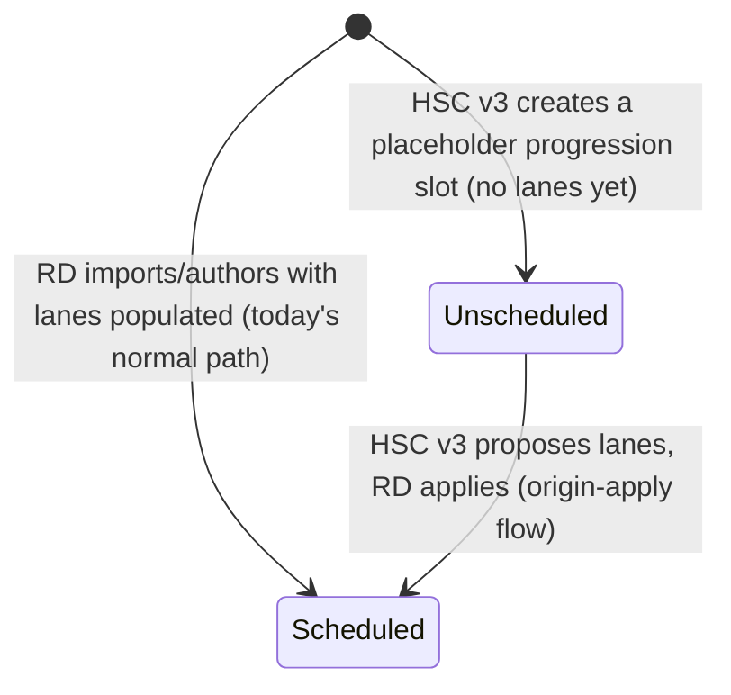
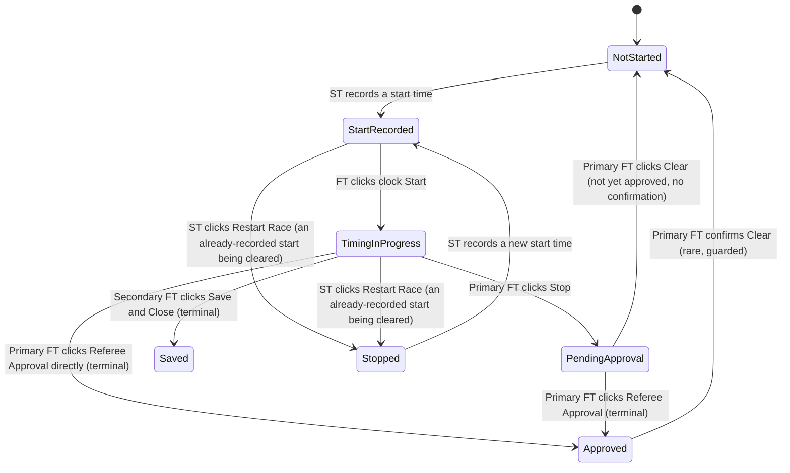
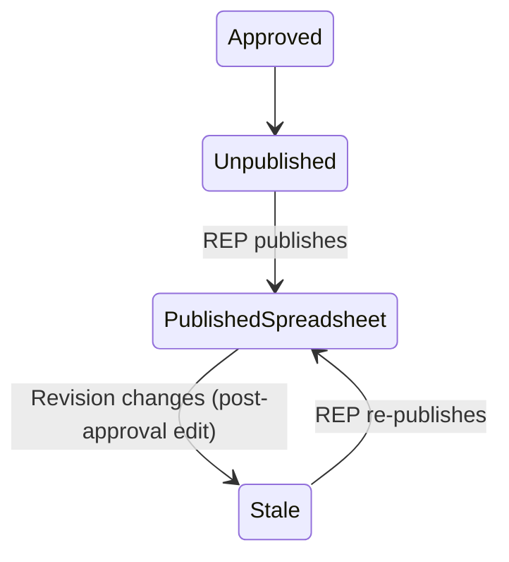
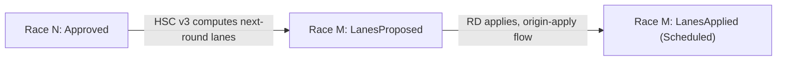

# Race state machine & attribute ownership

The single, canonical reference for what state a race is in, who owns
writing which attribute at each transition, how a persona's own race tree
learns about its own writes versus a peer's, and the shared "pane of glass"
race-tree model every persona (built or proposed) renders through.

**Status:** implemented (2026-09-19, PRs #99-#103) — every not-yet-built
persona (Awards, Developer, Results Publisher, Social Media, Streamer, Heat
Sheet Creator) should now be written against the model this doc defines,
not the other way around. Companion to [persona-plan.md](persona-plan.md)
and [schedule-data-model.md](schedule-data-model.md).

One correction from the original design, made during implementation:
`StatePendingApproval` needed its own persisted signal
(`RaceResult.StoppedAt`) to be genuinely reachable from disk-read data, not
just a live-only preview — see the "Display vocabulary" table and the
Phase 1 state diagram below for the corrected model. `internal/publish`
(Phase 3 below) is built but has no consumer yet, by design — it still
gates the personas above, none of which are built.

**Supersedes [reconciliation.md](reconciliation.md)** for state-transition
modeling — this doc reuses its per-team milestone ladder (see below) as the
one canonical timing state machine, so the two are not duplicated. It does
**not** carry forward that doc's verdict/disputed-resolution model:
reconciliation between the primary and secondary teams is fully and
permanently resolved by the primary FT's manual review via Compare
Secondary — see `reconciliation.md`'s own updated "Status" section. Nothing
downstream of an approved race ever reasons about a "verdict"; it only ever
sees the one, already-reconciled primary result.

## Why this document, why now

Every not-yet-built persona doc in this directory (`awards.md`,
`results-publisher.md`, `social-media.md`, `streamer.md`,
`heat-sheet-creator.md`) independently re-derives the same handful of
things: "is this race's result official yet" (`res.Approved`), "has my own
output gone stale since I last acted on this race" (a `{raceNumber:
revision}` staleness pattern, sketched three separate times), and "how does
my own tree learn about a value I just wrote." None of that is
persona-specific — it's the same question asked four times. This doc
answers it once, names the reusable pieces, and gives every future persona
(and the race tree itself) one shared vocabulary to build against.

## The full race lifecycle

A single race moves through four phases. The first two are per-team
(primary and secondary time independently); the second two concern the one
official result the rest of the system consumes.

### Phase 0 — Pre-timing (RD-owned, `ScheduleRace`)



`Unscheduled` does not exist in the codebase today — it is reserved for
[heat-sheet-creator.md](new/heat-sheet-creator.md)'s v3 progression work
(a Semi-Final/Final race created before its feeding heat has run). Every
race in the system today starts `Scheduled`. Orthogonal to both states: a
later lane-map edit re-stamps `ScheduleRace.LaneMapHash()`
(`internal/persona/store/schedule.go`); anything holding an older hash is
"stale" against the live schedule — a flag layered on top of whichever
state a race is in, not a state transition itself.

### Phase 1 — Timing (per team, independently)



This is [reconciliation.md](reconciliation.md)'s existing milestone ladder,
reused verbatim as the one canonical per-team state machine — see that
doc's "Per-race timing state" table for the exact `RaceResult` field
evidence per state. Two states are team-exclusive, not just typically
reached by one team: **`Saved` is reachable only by the secondary team**
(the primary FT's clock has no "save without approving" action — its only
commit path is Referee Approval); **`Approved` is reachable only by the
primary team** (the secondary FT's clock has no Referee Approval control at
all — `RaceResult.Approved` is permanently `false` in
`timing/secondary/finish.json`).

**`Approved` is terminal in the ordinary flow, with one explicit, guarded
exception.** The primary FT's Clear button, reopened against an already-
approved race, requires confirmation before it fully resets the in-memory
`RaceResult` (not just UI state) — a deliberate re-time, not a routine
action. Confirming it also suppresses winning-time auto-derivation for the
rest of that clock session: the Start Timer's original start time is not a
meaningful reference point for a race that already happened, so the
winning time is left for the referee's own direct entry rather than
re-trusting stale timing data. Clear on a *not-yet-approved* race needs no
confirmation and behaves exactly as the ordinary "mistaken first Start
click" case always has.

**`Stopped` is a genuinely new concept: an on-water safety halt** (the
referees stopping the race — possibly needing medics or other officials
present), not a routine data-entry correction. It has no dedicated field —
it's **inferred** from data that already exists:
`StartRecord.Cleared []ClearedStart`
(`internal/persona/store/log.go`) already accumulates every start the ST
has cleared (the RD tree's existing "Restarts" column,
`internal/regatta/director_tree.go:80-90`'s `directorStartCells`, is
already `len(rec.Cleared)`). The distinction that matters:

- `StartedAt == nil && len(Cleared) == 0` — never started — `NotStarted`.
- `StartedAt == nil && len(Cleared) > 0` — a start *was* recorded, then
  cleared — `Stopped`.

Per-race, ST-triggered only, by clicking the same button that has always
cleared a recorded start — **the underlying action does not change**
(`clearStartConfirmed`, `internal/regatta/start_timing.go:73-102`: zeroes
`StartRecord.StartedAt`, moves the old value into `Cleared[]`, persists via
`store.SaveStart`). Only its label changes, from "Clear" to **"Restart
Race"** — clicking it when a start already exists now explicitly reads as
"this race is restarting," matching what it has always inferred once a
prior start existed.

**`PendingApproval` is the primary FT's own "done collecting times,
awaiting the referee" signal** — clicking Stop. Unlike `Stopped`, it is
**optional, not a required gate**: Referee Approval is enabled by a valid
winning time in the entry field, not by Stop having been clicked, and that
field can already hold a plausible auto-derived value while the clock is
still running (`deriveWinningTime`, `internal/clock/persist.go`) — so the
primary FT can approve directly from `TimingInProgress` without ever
clicking Stop. `PendingApproval` exists for the common case where they do:
`RaceResult.StoppedAt` (`internal/clock/persist.go`'s `recordStop`,
primary-only — the secondary has no approval gate to signal) is what makes
it a real, disk-persisted state every consumer can see, not just a
live-only preview inside the primary FT's own open clock. Clear on a
`PendingApproval` race needs no confirmation, same as any other
not-yet-approved race — `performClear` zeroes the whole in-memory
`RaceResult`, `StoppedAt` included.

**Derived, not stored.** No field named "state" exists anywhere — every
consumer derives it via `store.DeriveTeamState(start, res)`
(`internal/persona/store/state.go`), which replaced the two places that
used to compute the same thing independently
(`internal/regatta/timer_races.go`'s `raceProgressStatus`,
`internal/clock/clock.go`'s retired `commitState`/`raceCommitState`) - and
a third instance found during that migration,
`internal/regatta/director_tree.go`'s `directorFinishCells`. All three
(plus the FT clock's own status line, `refreshCommitStatus`) now call the
one canonical derivation instead of their own switch.

### Display vocabulary — one set of labels, race tree and FT clock alike

The internal state names above are not what an operator sees. Every
persona's race tree and the FT clock's own status line (`c.commitStatus`)
render one shared vocabulary via `TeamState.DisplayText(team)`
(`internal/persona/store/state.go`) — the old `RaceInProgressText`/
`RaceSavedText`/`RaceApprovedText`/`CommitStatusPending` constants
(`internal/common/consts.go`) are retired:

| Internal state | Primary team shows | Secondary team shows | Trigger |
|---|---|---|---|
| `StateNotStarted` | **Pending Start** | **Pending Start** | No `StartRecord.StartedAt`, no `Cleared` history. |
| `StateStartRecorded` / `StateTimingInProgress` | **On the Water** | **On the Water** | A start is recorded (`StartedAt != nil`) — reused for both a first run and after an ST restart; the FT need not have clicked Start yet for the ST-side tree row, but the FT's own clock reaches this once `FirstFinishAt` is set. |
| `StateStopped` | **Stopped** | **Stopped** | `StartedAt == nil && len(Cleared) > 0` — see above. |
| `StatePendingApproval` | **Pending Approval** | *(unreachable)* | Primary team only: `RaceResult.StoppedAt != nil`, `WinningTime == ""`, not yet `Approved` — the primary FT clicked Stop, awaiting Referee Approval. Genuinely reachable from persisted data (see the `PendingApproval` explanation above), not a live-only preview. |
| `StateSaved` | *(unreachable)* | **Saved** | Secondary team only: `WinningTime != ""`, not yet `Approved` — Save and Close clicked. This *is* their terminal state, not "pending" — `WinningTime` is only ever written for the primary team together with `Approved = true` in the same atomic write (`persistFinish`), so this combination cannot occur for primary at all. |
| `StateApproved` | **Official** | *(unreachable)* | Referee Approval clicked — `RaceResult.Approved = true`. |

**"Official" terminology is an open research item, not fully settled.**
"Official" matches RegattaCentral's own vocabulary and the referee's real
phrase ("make it official") — the same milestone that already tells the
primary FT's own tree and the proposed Social Media (SOM) persona that a
result is ready to publish. But decorating results for an eventual
RegattaCentral push will need review against US Rowing's official
officiating rulebook, which has not been done yet — treat "Official" as
the working term until that review happens, not a final decision on every
possible milestone RC's own model might expect.

### Phase 2 — Official result lifecycle

Once the primary team reaches `Approved`, that `RaceResult` is *the*
result — the one the rest of the system (RD tree, and every downstream
persona) cares about. It does not become immutable: "every captured detail
... stays editable by the Finish Timer after the clock has stopped, so
results can be corrected against feedback from the course" (README.md).
So Phase 2 is really one state (`Approved`) plus a **change-detection
signal** riding alongside it: `internal/publish.Revision(pr)` hashes
only the *visible* fields (place, lane, school, time, winning time, title)
— an edit that changes nothing a reader would see does not move it. This
is what Phase 3's consumers key off, not `RaceResult.Approved` itself
(which does not change on a post-approval correction).

### Phase 3 — Downstream consumption (parallel, not linear)



Each future persona tracks its **own** "have I acted on this race yet"
independently — there is no single shared "published" flag, because
different consumers publish to different destinations at different times.
The shape above repeats once per consumer, all keyed off the same
`Revision`:

- **Results Publisher (REP)** — spreadsheet now, RegattaCentral later, per
  [results-publisher.md](new/results-publisher.md).
- **Social Media (SOM)** — posted to X, per
  [social-media.md](new/social-media.md).
- **Streamer (STM)** — *two* independent sub-states, not one: lane-image
  freshness (keyed off `ScheduleRace.LaneMapHash`, tracks Phase 0, not
  Phase 2) and results-image freshness (keyed off `Revision`, tracks Phase
  2), per [streamer.md](new/streamer.md).

**Awards (AWD) and Developer (DEV) are pure read-only viewers with no
persisted state of their own** — they render whatever `Approved`/`Revision`
currently says, with nothing to track between renders.

### Cross-race edge — Heat Sheet Creator v3 (genuinely new)



This is the one place a race's own state transition has an edge into a
*different* race's state — a heat reaching `Approved` is what lets
[heat-sheet-creator.md](new/heat-sheet-creator.md)'s v3 increment propose
lane assignments for the Semi-Final/Final it feeds, following the VASRA
progression algorithm already documented there. HSC never writes
`regattaSchedule.json` directly (one-writer-per-file, unchanged); it
proposes, and the race moves from `Unscheduled`/`LanesProposed` back into
ordinary Phase 0 `Scheduled` only once the RD applies it.

## Attribute ownership

| Attribute | Field(s) | Owner (sole writer) | File | Written by |
|---|---|---|---|---|
| Schedule / lane assignments | `Schedule`, `ScheduleRace`, `ScheduleEntry` | Regatta Director | `director/regattaSchedule.json` | Import/apply (`saveRegattaData`), legacy `data.json` migration |
| Start time | `StartRecord.StartedAt`, `.Clock` | Start Timer (own team) | `timing/<team>/start.json` | `recordStart` / `clearStartConfirmed` / `restoreStartConfirmed` → `persistStart` (`internal/regatta/start_timing.go`) |
| First-finish click | `RaceResult.FirstFinishAt`, `.FirstFinishClock` | Finish Timer (own team) | `timing/<team>/finish.json` | `recordFirstFinish` — clock Start click (`internal/clock/persist.go`) |
| Stop / awaiting approval | `RaceResult.StoppedAt` | **Primary Finish Timer only** | `timing/primary/finish.json` | `recordStop` — clock Stop click (`internal/clock/persist.go`); never set for the secondary team |
| Winning time / lap rows | `RaceResult.WinningTime`, `.Rows` | Finish Timer (own team) | same | `persistFinish` (`internal/clock/persist.go`) |
| Official approval | `RaceResult.Approved`, `.ApprovedAt` | **Primary Finish Timer only** | `timing/primary/finish.json` | Referee Approval → `persistFinish(true)` (`internal/clock/buttons.go`'s `refereeApprovalFunc`) |
| Secondary commit (never official) | `RaceResult.Approved` (permanently `false`) | Secondary Finish Timer | `timing/secondary/finish.json` | Save and Close → `persistFinish(false)` (`buttons.go`'s `initSave`) |
| Downstream publish/post tracking | e.g. `{raceNumber: Revision}` | REP / SOM / STM, each independently | Fyne `Preferences` (a pref key per consumer), **not** `regattaData` | The consumer's own publish action |

Every row is enforced by `store.SaveSchedule`/`SaveStart`/`SaveFinish`
guarding on `persona.Role` (`ErrWrongPersona` otherwise) and, for
`Start`/`Finish`, independently keyed by `Team` — `timing/primary/finish.json`
and `timing/secondary/finish.json` are two wholly separate one-writer
files, never a shared one. This table is the concrete instance of
[schedule-data-model.md](schedule-data-model.md)'s "one attribute, one
writer" principle — nothing here changes that principle, it just makes the
full instance of it explicit in one place.

## The in-memory-vs-watcher rule

**A persona's own write updates its own UI entirely in memory. The file
watcher (`internal/watcher`) exists exclusively to learn about *other*
personas' writes, and structurally cannot fire on a persona's own output —
its own file is never added to its own watched-path list in the first
place.**

Evidence: `startWatcher` (`internal/regatta/persona_startup.go:431-462`)
builds each role's watched-path list explicitly —

```go
paths := []string{s.SchedulePath()}
switch s.Role {
case persona.RoleFinish:
    paths = append(paths, s.StartPath())            // peer start times
    if s.Team == persona.TeamPrimary && r.secondaryFinishPath != "" {
        paths = append(paths, r.secondaryFinishPath) // SFT results, Compare Secondary
    }
case persona.RoleStart:
    paths = append(paths, s.FinishPath())            // same-team FT progress, for the row lock
case persona.RoleDirector:
    paths = append(paths, directorWatchPaths(s.Root)...) // both teams' start + finish
}
```

A Start Timer never watches its own `start.json`; a Finish Timer never
watches its own `finish.json`. `Watcher.Add()` is only ever called with
these paths, so a persona's own output file is never registered — there is
no code path that could even receive a self-triggered event.

Instead, every write-then-refresh flow updates the UI directly from the
same in-memory struct it just wrote: `persistFinish` calls
`c.refreshCommitStatus()` immediately after `store.SaveFinish` succeeds,
reading straight from `c.finishLog` — the same `*store.FinishLog` the clock
was constructed with (`clock.go:229`, passed by pointer, so it *is*
`r.finishLog` on the `Regatta` too). Closing the clock window calls
`r.refreshAllRows()` (`start_timing.go:198-203`), which reads
`r.finishLog.Races[n]` — never a disk re-read. The Start Timer's
`recordStart`/`clearStartConfirmed`/`restoreStartConfirmed` follow the
identical shape: mutate `r.startLog`, `persistStart()`, call
`r.refreshRow(n)` directly.

The Regatta Director is the clean contrast: it never writes `start.json`/
`finish.json`, so it has no in-memory copy from its own action — its row
updates exist *only* via the watcher, `applyDirectorTimingEvent`
(`director_tree.go:119-155`) unmarshalling a delivered `Event` fresh off
disk and calling `onDirectorTeamChanged` → `refreshAllRows`.

**Rule for every future persona**: if you write a file, refresh your own
UI from the in-memory value you just wrote — never register your own
output path with your own watcher, and never wait for a watcher round-trip
to see your own change. If you only read a file another persona owns,
watch it.

## The pane-of-glass race tree

One `raceRow` type and one row-building/refresh dispatch
(`internal/regatta/timer_races.go`, `races.go`) — `newRaceRow` and
`raceListHeader` each build one shared column set, with a per-role
`switch r.session.Role` only around the action cell. Every role's tree
shows the identical data columns, left to right: **Race number,
Scheduled Time** (left-anchored) — the race's title/detail (flexible
width) — the role's **action** (Start/Clear-or-Restart-Race for the ST,
Time Race for the FT, none for the read-only RD) — **Restarts, Start
Time, Winning Time, Status** (right-anchored). This is a real,
user-visible change, not just a code consolidation: the ST and FT trees
never showed Restarts or Winning Time before this — both roles already
had access to the same underlying `start.json`/`finish.json` data their
own refresh functions already read for other purposes, so extending
those two columns to every role was additive visibility, not new data
plumbing. `restartsCell`/`winningTimeCell` (`timer_races.go`) are the
shared cell-formatting helpers every role's refresh function now calls,
mirroring `raceProgressStatus`'s own shared-derivation precedent so
neither placeholder rule is duplicated a third time.

`store.CanPublish`/`store.CanTrackWallClock` (`internal/persona/store/state.go`)
are the named, discoverable button-gating helpers every not-yet-built
persona doc should call instead of its own inline `res.Approved`/
`StartRecord.StartedAt != nil` check.

## What changed in code

Four concrete, named pieces — delivered across PRs #99-#103:

1. **One canonical team-state derivation** (PR #99, #100), replacing
   `raceProgressStatus` (`internal/regatta/timer_races.go`),
   `directorFinishCells` (`internal/regatta/director_tree.go` — a third
   duplicate found during the migration, not named in the original design),
   and `commitState`/`raceCommitState` (`internal/clock/clock.go`, retired
   entirely):

   ```go
   // internal/persona/store/state.go
   type TeamState int

   const (
       StateNotStarted TeamState = iota
       StateStopped          // ST-side: start recorded, then cleared - an on-water halt
       StateStartRecorded
       StateTimingInProgress
       StatePendingApproval  // primary only - FT clicked Stop, not yet approved
       StateSaved            // reachable by the secondary team only
       StateApproved         // reachable by the primary team only
   )

   func DeriveTeamState(start StartRecord, res RaceResult) TeamState

   // DisplayText renders the team-aware label from the "Display vocabulary"
   // table above - team is always the team WHOSE state this is (the race's
   // timing team), never the viewer's own session team; a caller reading
   // primary-team data (the RD tree) always passes persona.TeamPrimary.
   func (s TeamState) DisplayText(team persona.Team) string

   func CanPublish(res RaceResult) bool
   func CanTrackWallClock(start StartRecord) bool
   ```

   Lives in `internal/persona/store`, next to `StartRecord`/`RaceResult`
   themselves, so both `internal/regatta` and `internal/clock` import it
   without a new cross-package dependency. `StatePendingApproval` needed
   `RaceResult.StoppedAt` (PR #99) to be reachable at all — see the
   `PendingApproval` explanation under Phase 1 above.

2. **`store.CanPublish`/`store.CanTrackWallClock`** (PR #99, alongside
   `state.go`) — the named, discoverable button-gating helpers every
   not-yet-built persona doc should call instead of its own inline
   `res.Approved == true` / `StartRecord.StartedAt != nil` check. Not yet
   called by any existing code (today's ST/FT/RD buttons have their own,
   genuinely different gating - e.g. the ST's Start/Clear enablement is
   about lock state, not publishability) - these exist for the
   not-yet-built personas that will use them from the start.

3. **`internal/publish`** (PR #101), built as sketched in
   `sidecar-personas.md`'s Phase 0a — `PublishableRace`, `Row`,
   `BuildView`, `Revision`, `RenderText` — plus the one addition this doc
   introduced:

   ```go
   // internal/publish/publish.go
   func IsStale(published map[int]string, pr PublishableRace) bool {
       return published[pr.RaceNumber] != Revision(pr)
   }
   ```

   No consumer yet - intentionally build-ahead-of-use. REP, SOM, and STM's
   results-image path should call `publish.IsStale` against their own
   `{raceNumber: Revision}` preference map, instead of three independent
   re-implementations of the same comparison.

4. **Unified `raceRow`/`raceListHeader`** (PR #102) — one shared column set
   (Race number, Scheduled Time, the role's action, Restarts, Start Time,
   Winning Time, Status) instead of three independent per-role layouts.
   Extended ST and FT's trees to show Restarts/Winning Time for the first
   time (previously RD-only) - both roles already had the underlying data,
   so this was additive visibility, not new data plumbing. Also relabels
   the ST's Clear button to "Restart Race" once a start exists (PR #103,
   label only - `clearStartConfirmed` is unchanged).

## What's next for not-yet-built personas

Every not-yet-built persona (Awards, Developer, Results Publisher, Social
Media, Streamer, Heat Sheet Creator v1) should be built against
`store.TeamState`/`CanPublish`/`CanTrackWallClock` and `publish.IsStale`
from the start, not retrofitted onto them later — each one's own doc still
independently sketches a `res.Approved == true` check or a staleness
pattern; those should be replaced with a line pointing here as each persona
gets built.

**HSC v3's cross-race edge** (Phase 0/"Cross-race edge" above) has its own
separate design gap already flagged in `heat-sheet-creator.md`
(round-type/progression metadata on `store.ScheduleRace`) — this doc's
state model is consistent with that gap, but does not resolve it; HSC v3's
own design pass still owns that piece.
