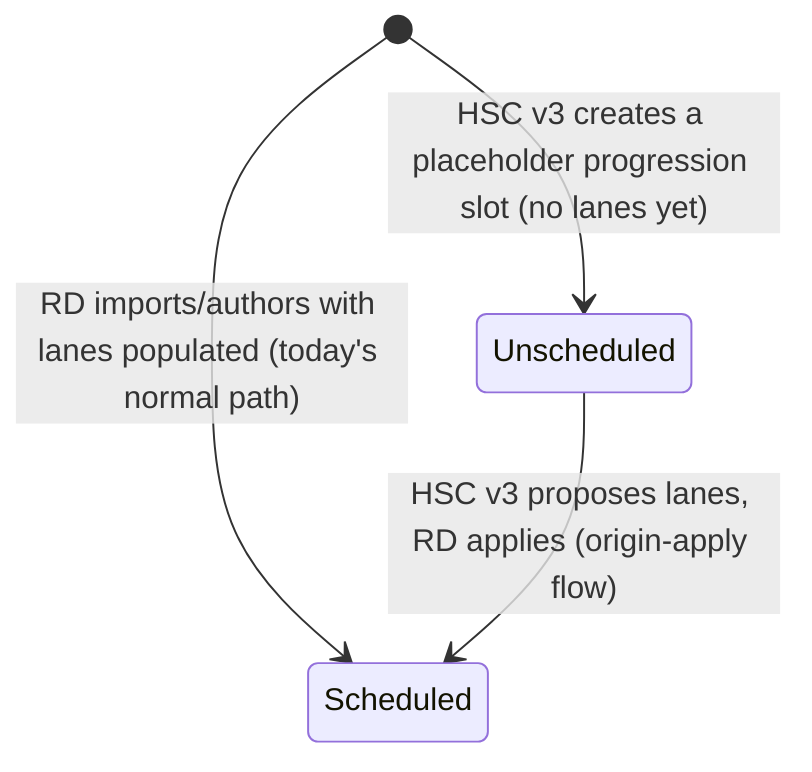
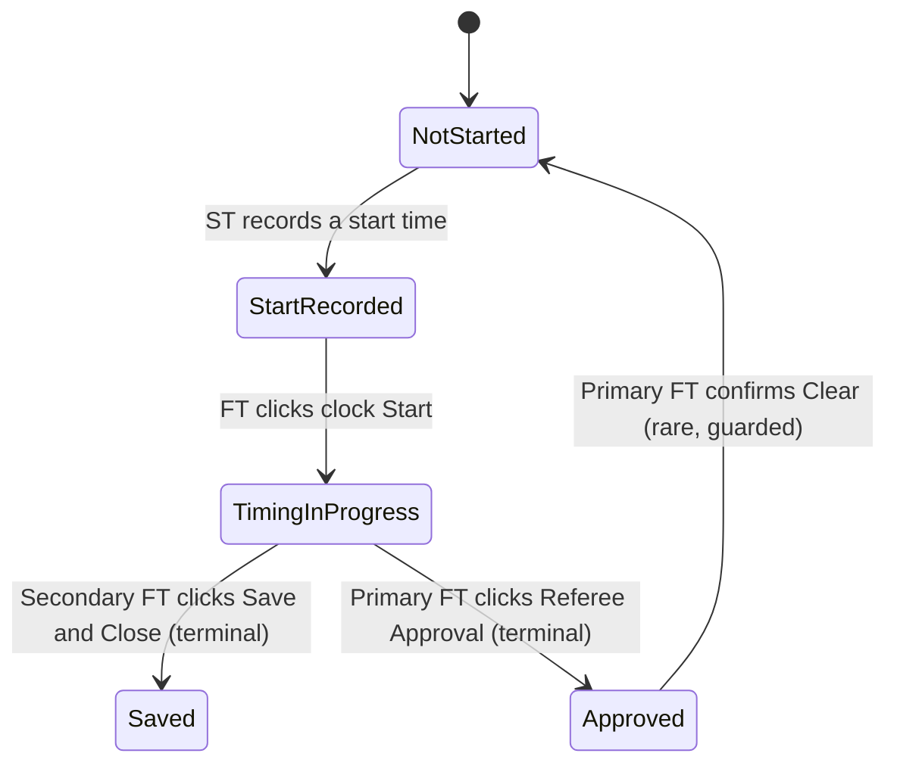
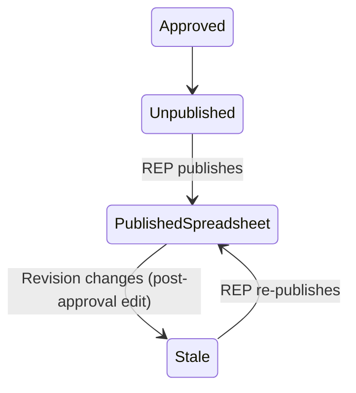
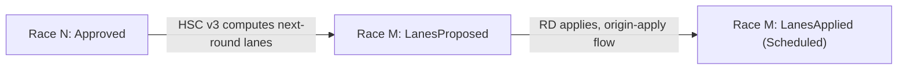

# Race state machine & attribute ownership

The single, canonical reference for what state a race is in, who owns
writing which attribute at each transition, how a persona's own race tree
learns about its own writes versus a peer's, and the shared "pane of glass"
race-tree model every persona (built or proposed) renders through.

**Status:** design, not yet implemented. `develop` is in feature freeze
during pre-release functional testing; this doc is the next work to land
once that lifts, and it lands **before** any of the not-yet-built personas
(Awards, Developer, Results Publisher, Social Media, Streamer, Heat Sheet
Creator) are implemented — every one of them is written against the model
this doc defines, not the other way around. Companion to
[persona-plan.md](persona-plan.md) and [schedule-data-model.md](schedule-data-model.md).

**Supersedes [reconciliation.md](reconciliation.md)** for state-transition
modeling — this doc reuses its per-team milestone ladder (see below) as the
one canonical timing state machine, so the two are not duplicated. It does
**not** carry forward that doc's verdict/disputed-resolution model:
reconciliation between the primary and secondary teams is fully and
permanently resolved by the primary FT's manual review via Compare
Secondary — see `reconciliation.md`'s own updated "Status" section. Nothing
downstream of an approved race ever reasons about a "verdict"; it only ever
sees the one, already-reconciled primary result.

## Why this document, why now

Every not-yet-built persona doc in this directory (`awards.md`,
`results-publisher.md`, `social-media.md`, `streamer.md`,
`heat-sheet-creator.md`) independently re-derives the same handful of
things: "is this race's result official yet" (`res.Approved`), "has my own
output gone stale since I last acted on this race" (a `{raceNumber:
revision}` staleness pattern, sketched three separate times), and "how does
my own tree learn about a value I just wrote." None of that is
persona-specific — it's the same question asked four times. This doc
answers it once, names the reusable pieces, and gives every future persona
(and the race tree itself) one shared vocabulary to build against.

## The full race lifecycle

A single race moves through four phases. The first two are per-team
(primary and secondary time independently); the second two concern the one
official result the rest of the system consumes.

### Phase 0 — Pre-timing (RD-owned, `ScheduleRace`)



`Unscheduled` does not exist in the codebase today — it is reserved for
[heat-sheet-creator.md](new/heat-sheet-creator.md)'s v3 progression work
(a Semi-Final/Final race created before its feeding heat has run). Every
race in the system today starts `Scheduled`. Orthogonal to both states: a
later lane-map edit re-stamps `ScheduleRace.LaneMapHash()`
(`internal/persona/store/schedule.go`); anything holding an older hash is
"stale" against the live schedule — a flag layered on top of whichever
state a race is in, not a state transition itself.

### Phase 1 — Timing (per team, independently)



This is [reconciliation.md](reconciliation.md)'s existing milestone ladder,
reused verbatim as the one canonical per-team state machine — see that
doc's "Per-race timing state" table for the exact `RaceResult` field
evidence per state. Two states are team-exclusive, not just typically
reached by one team: **`Saved` is reachable only by the secondary team**
(the primary FT's clock has no "save without approving" action — its only
commit path is Referee Approval); **`Approved` is reachable only by the
primary team** (the secondary FT's clock has no Referee Approval control at
all — `RaceResult.Approved` is permanently `false` in
`timing/secondary/finish.json`).

**`Approved` is terminal in the ordinary flow, with one explicit, guarded
exception.** The primary FT's Clear button, reopened against an already-
approved race, requires confirmation before it fully resets the in-memory
`RaceResult` (not just UI state) — a deliberate re-time, not a routine
action. Confirming it also suppresses winning-time auto-derivation for the
rest of that clock session: the Start Timer's original start time is not a
meaningful reference point for a race that already happened, so the
winning time is left for the referee's own direct entry rather than
re-trusting stale timing data. Clear on a *not-yet-approved* race needs no
confirmation and behaves exactly as the ordinary "mistaken first Start
click" case always has.

**Derived, not stored.** No field named "state" exists anywhere — every
consumer derives it from `RaceResult`/`StartRecord` on the fly. Today this
happens in **two places that compute the same thing independently**:
`internal/regatta/timer_races.go:189-198`'s `raceProgressStatus` (a
three-way switch: `Approved` → `RaceApprovedText`, `WinningTime != ""` →
`RaceSavedText`, else `RaceInProgressText` —
`internal/common/consts.go:175,176,188`) and
`internal/clock/clock.go:143-172`'s `commitState` type +
`raceCommitState()` method (the identical three-way switch, its own
`statePending`/`stateSaved`/`stateApproved` enum). See "Redesign: one
canonical `TeamState`" below.

### Phase 2 — Official result lifecycle

Once the primary team reaches `Approved`, that `RaceResult` is *the*
result — the one the rest of the system (RD tree, and every downstream
persona) cares about. It does not become immutable: "every captured detail
... stays editable by the Finish Timer after the clock has stopped, so
results can be corrected against feedback from the course" (README.md).
So Phase 2 is really one state (`Approved`) plus a **change-detection
signal** riding alongside it: `internal/publish.Revision(pr)` (sketched in
[sidecar-personas.md](sidecar-personas.md) Phase 0a, not yet built) hashes
only the *visible* fields (place, lane, school, time, winning time, title)
— an edit that changes nothing a reader would see does not move it. This
is what Phase 3's consumers key off, not `RaceResult.Approved` itself
(which does not change on a post-approval correction).

### Phase 3 — Downstream consumption (parallel, not linear)



Each future persona tracks its **own** "have I acted on this race yet"
independently — there is no single shared "published" flag, because
different consumers publish to different destinations at different times.
The shape above repeats once per consumer, all keyed off the same
`Revision`:

- **Results Publisher (REP)** — spreadsheet now, RegattaCentral later, per
  [results-publisher.md](new/results-publisher.md).
- **Social Media (SOM)** — posted to X, per
  [social-media.md](new/social-media.md).
- **Streamer (STM)** — *two* independent sub-states, not one: lane-image
  freshness (keyed off `ScheduleRace.LaneMapHash`, tracks Phase 0, not
  Phase 2) and results-image freshness (keyed off `Revision`, tracks Phase
  2), per [streamer.md](new/streamer.md).

**Awards (AWD) and Developer (DEV) are pure read-only viewers with no
persisted state of their own** — they render whatever `Approved`/`Revision`
currently says, with nothing to track between renders.

### Cross-race edge — Heat Sheet Creator v3 (genuinely new)



This is the one place a race's own state transition has an edge into a
*different* race's state — a heat reaching `Approved` is what lets
[heat-sheet-creator.md](new/heat-sheet-creator.md)'s v3 increment propose
lane assignments for the Semi-Final/Final it feeds, following the VASRA
progression algorithm already documented there. HSC never writes
`regattaSchedule.json` directly (one-writer-per-file, unchanged); it
proposes, and the race moves from `Unscheduled`/`LanesProposed` back into
ordinary Phase 0 `Scheduled` only once the RD applies it.

## Attribute ownership

| Attribute | Field(s) | Owner (sole writer) | File | Written by |
|---|---|---|---|---|
| Schedule / lane assignments | `Schedule`, `ScheduleRace`, `ScheduleEntry` | Regatta Director | `director/regattaSchedule.json` | Import/apply (`saveRegattaData`), legacy `data.json` migration |
| Start time | `StartRecord.StartedAt`, `.Clock` | Start Timer (own team) | `timing/<team>/start.json` | `recordStart` / `clearStartConfirmed` / `restoreStartConfirmed` → `persistStart` (`internal/regatta/start_timing.go`) |
| First-finish click | `RaceResult.FirstFinishAt`, `.FirstFinishClock` | Finish Timer (own team) | `timing/<team>/finish.json` | `recordFirstFinish` — clock Start click (`internal/clock/persist.go:31-63`) |
| Winning time / lap rows | `RaceResult.WinningTime`, `.Rows` | Finish Timer (own team) | same | `persistFinish` (`persist.go:267-295`) |
| Official approval | `RaceResult.Approved`, `.ApprovedAt` | **Primary Finish Timer only** | `timing/primary/finish.json` | Referee Approval → `persistFinish(true)` (`internal/clock/buttons.go:190`) |
| Secondary commit (never official) | `RaceResult.Approved` (permanently `false`) | Secondary Finish Timer | `timing/secondary/finish.json` | Save and Close → `persistFinish(false)` (`buttons.go:201`) |
| Downstream publish/post tracking | e.g. `{raceNumber: Revision}` | REP / SOM / STM, each independently | Fyne `Preferences` (a pref key per consumer), **not** `regattaData` | The consumer's own publish action |

Every row is enforced by `store.SaveSchedule`/`SaveStart`/`SaveFinish`
guarding on `persona.Role` (`ErrWrongPersona` otherwise) and, for
`Start`/`Finish`, independently keyed by `Team` — `timing/primary/finish.json`
and `timing/secondary/finish.json` are two wholly separate one-writer
files, never a shared one. This table is the concrete instance of
[schedule-data-model.md](schedule-data-model.md)'s "one attribute, one
writer" principle — nothing here changes that principle, it just makes the
full instance of it explicit in one place.

## The in-memory-vs-watcher rule

**A persona's own write updates its own UI entirely in memory. The file
watcher (`internal/watcher`) exists exclusively to learn about *other*
personas' writes, and structurally cannot fire on a persona's own output —
its own file is never added to its own watched-path list in the first
place.**

Evidence: `startWatcher` (`internal/regatta/persona_startup.go:431-462`)
builds each role's watched-path list explicitly —

```go
paths := []string{s.SchedulePath()}
switch s.Role {
case persona.RoleFinish:
    paths = append(paths, s.StartPath())            // peer start times
    if s.Team == persona.TeamPrimary && r.secondaryFinishPath != "" {
        paths = append(paths, r.secondaryFinishPath) // SFT results, Compare Secondary
    }
case persona.RoleStart:
    paths = append(paths, s.FinishPath())            // same-team FT progress, for the row lock
case persona.RoleDirector:
    paths = append(paths, directorWatchPaths(s.Root)...) // both teams' start + finish
}
```

A Start Timer never watches its own `start.json`; a Finish Timer never
watches its own `finish.json`. `Watcher.Add()` is only ever called with
these paths, so a persona's own output file is never registered — there is
no code path that could even receive a self-triggered event.

Instead, every write-then-refresh flow updates the UI directly from the
same in-memory struct it just wrote: `persistFinish` calls
`c.refreshCommitStatus()` immediately after `store.SaveFinish` succeeds,
reading straight from `c.finishLog` — the same `*store.FinishLog` the clock
was constructed with (`clock.go:229`, passed by pointer, so it *is*
`r.finishLog` on the `Regatta` too). Closing the clock window calls
`r.refreshAllRows()` (`start_timing.go:198-203`), which reads
`r.finishLog.Races[n]` — never a disk re-read. The Start Timer's
`recordStart`/`clearStartConfirmed`/`restoreStartConfirmed` follow the
identical shape: mutate `r.startLog`, `persistStart()`, call
`r.refreshRow(n)` directly.

The Regatta Director is the clean contrast: it never writes `start.json`/
`finish.json`, so it has no in-memory copy from its own action — its row
updates exist *only* via the watcher, `applyDirectorTimingEvent`
(`director_tree.go:119-155`) unmarshalling a delivered `Event` fresh off
disk and calling `onDirectorTeamChanged` → `refreshAllRows`.

**Rule for every future persona**: if you write a file, refresh your own
UI from the in-memory value you just wrote — never register your own
output path with your own watcher, and never wait for a watcher round-trip
to see your own change. If you only read a file another persona owns,
watch it.

## The pane-of-glass race tree

### What's already shared

One `raceRow` type and one row-building/refresh dispatch already exist
(`internal/regatta/timer_races.go`, `races.go`) — `newRaceRow` and
`raceListHeader` each have a single `switch r.session.Role` (Start /
Finish / default-Director). PST and SST share the Start arm verbatim; PFT
and SFT share the Finish arm verbatim; the Regatta Director's row is the
*same* `raceRow` type, not a separate one — it just reads primary-team-only
data. `fixedCell` (`races.go`) is already a generic, role-agnostic
width/padding primitive. There is no structural blocker to a shared
layout — the redesign is choosing one canonical column set and collapsing
the two parallel role-switches into one.

### Today's columns, per role

| Role | Columns today |
|---|---|
| PST / SST | Actions (Start/Clear/Restore) · Start Time · Status/lock-note |
| PFT / SFT | Time Race button · Start Time · Status |
| RD (primary team only) | Restarts · Start Time · Winning Time · Approved/Status |

The union is small: **Title** (every row, with stale-lane/conflict marks),
**Status**, **Start Time**, **Winning Time**, **Restarts**, and a
**role-specific action button**. That union is the pane-of-glass column
set — every persona's tree shows the same columns; what differs is which
action button(s) render in the action column, and whether they're enabled.

### The missing piece: no shared button-gating helper

`setEnabled` (`timer_races.go:245-254`) is the only existing
enable/disable helper, and it's ST-specific (gated on `StartRecord`/lock
state, not `Approved`). Every not-yet-built persona doc independently
writes its own `res.Approved == true` check: `awards.md` ("View Results"),
`results-publisher.md` ("Publish"), `social-media.md` ("Publish" in the
Social sidecar), `streamer.md` (results-PNG generation — plus its own
*separate* "run clock" button gated on `StartRecord.StartedAt != nil`, not
`Approved`, a second, independent gating condition worth naming too).

## Redesign: what changes in code

Four concrete, named pieces — the answer to "what does this doc actually
change," not just what it documents:

1. **One canonical team-state derivation**, replacing
   `raceProgressStatus` (`timer_races.go:189-198`) and `commitState`/
   `raceCommitState` (`clock.go:143-172`)'s duplicate three-way switches:

   ```go
   // internal/persona/store/state.go (new)
   type TeamState int

   const (
       StateNotStarted TeamState = iota
       StateStartRecorded
       StateTimingInProgress
       StateSaved    // reachable by the secondary team only
       StateApproved // reachable by the primary team only
   )

   func DeriveTeamState(start *StartRecord, res RaceResult) TeamState
   ```

   Lives in `internal/persona/store`, next to `StartRecord`/`RaceResult`
   themselves, so both `internal/regatta` and `internal/clock` import it
   without a new cross-package dependency. `raceProgressStatus` and
   `commitState` become thin display-text wrappers over `TeamState` (or
   are deleted in favor of a shared `TeamState.DisplayText()`), not
   independent derivations.

2. **One shared button-gating helper**, replacing every persona doc's own
   `res.Approved == true`:

   ```go
   // internal/persona/store/state.go (new)
   func CanPublish(res RaceResult) bool { return res.Approved }
   ```

   Thin today, but a single named, discoverable, extensible call site —
   `awards.md`/`results-publisher.md`/`social-media.md`/`streamer.md`'s
   results-PNG path all reference `store.CanPublish` instead of
   re-deriving the check independently. `streamer.md`'s separate
   "run clock" gate (`StartRecord.StartedAt != nil`) gets its own named
   sibling, e.g. `store.CanTrackWallClock`, for the same discoverability
   reason.

3. **`internal/publish`, built as sketched** (`sidecar-personas.md` Phase
   0a, not yet real code) — `PublishableRace`, `BuildView`, `Revision`,
   `RenderText` — plus one new addition this doc introduces:

   ```go
   // internal/publish/publish.go
   func IsStale(published map[int]string, pr PublishableRace) bool {
       return published[pr.RaceNumber] != Revision(pr)
   }
   ```

   REP, SOM, and STM's results-image path all call `publish.IsStale`
   against their own `{raceNumber: Revision}` preference map, instead of
   three independent re-implementations of the same comparison.

4. **Unified `raceRow`/`raceListHeader`** — one column set (Title, Status,
   Start Time, Winning Time, Restarts) plus a per-role function returning
   that role's action button(s), each button wired to
   `store.CanPublish`/`DeriveTeamState` rather than an inline check. This
   collapses `newRaceRow`'s and `raceListHeader`'s parallel
   `switch r.session.Role` blocks into one shared row shape and one
   per-role button-list function.

## Existing-code reuse analysis

- `internal/persona/store` already owns `StartRecord`/`RaceResult` — the
  natural, import-cycle-free home for `TeamState`/`CanPublish`, not a new
  package.
- `reconciliation.md`'s milestone ladder — reused as Phase 1 verbatim, not
  re-derived; its verdict/disputed model is explicitly not carried forward
  (see that doc's own updated Status).
- `internal/publish`'s Phase 0a sketch (`sidecar-personas.md`) — already
  fully designed, just not yet built; this doc adds one function
  (`IsStale`) to what's already there.
- `internal/regatta/timer_races.go`'s `raceRow`/`fixedCell` — already the
  right shape for a unified row; the redesign is subtraction (collapsing
  two role-switches into one), not new infrastructure.
- Every not-yet-built persona doc (`awards.md`, `results-publisher.md`,
  `social-media.md`, `streamer.md`) already independently converges on
  `RaceResult.Approved` as its gate — this doc's `store.CanPublish` is
  the same check, named once.

## High-level implementation plan

1. **`internal/persona/store/state.go`**: `TeamState` enum,
   `DeriveTeamState`, `CanPublish`, `CanTrackWallClock`. Unit tests
   table-driven against every `(StartRecord, RaceResult)` combination in
   the milestone ladder, including the primary/secondary-exclusive states.
2. **Migrate existing call sites**: `raceProgressStatus` and
   `clock.commitState`/`raceCommitState` become wrappers over
   `store.DeriveTeamState`, with existing tests updated to assert the
   same observable text/enum, not rewritten from scratch.
3. **`internal/publish`**: build Phase 0a as already sketched, plus
   `IsStale`. No UI yet — this is the shared data/staleness layer every
   downstream persona depends on.
4. **Race-tree redesign**: collapse `newRaceRow`/`raceListHeader`'s
   parallel role-switches into one shared column set + per-role button-list
   function, wired to the new helpers. This is the "pane of glass" —
   existing PST/SST/PFT/SFT/RD trees keep behaving identically (same
   columns they already show, same buttons), just built from shared code
   instead of duplicated switches, since today's union of columns already
   matches what each role shows.
5. **Docs** (once built): update this doc's own status; each not-yet-built
   persona doc's "Existing-code reuse analysis" gets a line pointing at
   `store.CanPublish`/`TeamState` and `publish.IsStale` instead of its own
   bespoke check.

## Dependencies and sequencing

- **No architectural blocker** beyond `develop`'s feature freeze (see
  `AGENTS.md`) — every piece named above (steps 1-3) is new, additive code
  with no dependency on anything else currently in flight (not the
  RegattaCentral investigation, not HSC, not Streamer).
- **Gates every not-yet-built persona's implementation** (not their
  proposal docs, which stay as written): Awards, Developer, Results
  Publisher, Social Media, Streamer, and Heat Sheet Creator v1 should all
  be built against `store.TeamState`/`CanPublish` and `publish.IsStale`
  from the start, not retrofitted onto them later. Per the author,
  **this is the next feature to land once the freeze lifts, before any of
  those personas' implementation begins.**
- **HSC v3's cross-race edge** (Phase 0/"Cross-race edge" above) has its
  own separate design gap already flagged in `heat-sheet-creator.md`
  (round-type/progression metadata on `store.ScheduleRace`) — this doc's
  state model is consistent with that gap, but does not resolve it; HSC
  v3's own design pass still owns that piece.
