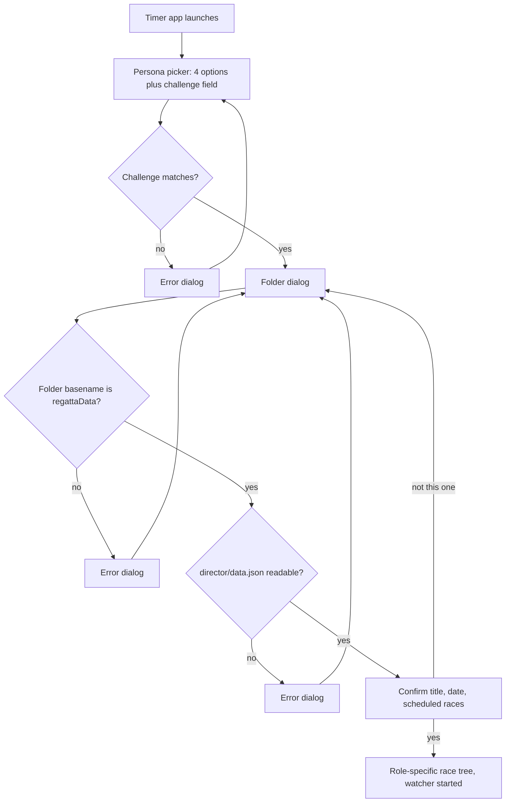

# Persona Implementation Plan

Implementation plan for the persona feature described in [persona.md](persona.md).

## 1. Decisions made up front

These three answers shape everything below.

- **Sharing model: OneDrive on Windows**, mirrored onto each machine. This rules out filesystem-event watching and makes propagation latency (seconds, sometimes tens of seconds) a first-class design concern. Section 12 covers the OneDrive-specific consequences, several of which change the implementation rather than just the operating instructions.
- **File granularity: one file per team + persona.** Every file has exactly one writer. Everyone else opens it read-only. There is no lock contention to manage because there is no shared write target.
- **Regatta Director: a separate entry point.** Timers get a binary that cannot reach RD functions at all.

## 2. Two problems the requirements do not mention

Both are load-bearing and should be settled before coding starts.

### 2.1 Clock skew between machines is a correctness bug, not an edge case

The requirement in [persona.md](persona.md) is that the winning time becomes `FT Start click - ST Start Time`. Those two timestamps come from two different laptops. If the ST machine's clock is 3 seconds ahead of the FT machine's, **every race time in the regatta is wrong by 3 seconds**, silently, with no visible symptom. Consumer laptops routinely drift by seconds when they have been asleep or off Wi-Fi.

**Only the cross-machine math is exposed.** Within one machine, lap splits are safe: `getElapsedTime` computes `time.Since(c.clockState.startTime)` where `startTime` came from `time.Now()`, and Go embeds a monotonic reading in both, so `time.Since` is immune to wall-clock jumps. That monotonic reading is stripped the moment a `time.Time` is marshalled to JSON, which is precisely why the ST-to-FT calculation — the only one that crosses a process boundary — is the vulnerable one.

#### Measure the offset; do not set the clock

The instinct is to force a time sync at startup. On Windows that means `w32tm /resync`, and it is the wrong tool here:

- It needs elevation. Setting the system time requires the `SE_SYSTEMTIME_NAME` privilege, so a GUI app would throw a UAC prompt on every launch, and on org-managed devices a standard user often cannot consent to it at all.
- It fails in exactly the conditions we care about. The W32Time service is trigger-start on non-domain Windows and may not be running at all, and on a domain-joined laptop it syncs against the domain controller hierarchy — unreachable from a boathouse on a phone hotspot.
- It destroys the evidence. Setting the clock overwrites the only record of how wrong it was, so a regatta timed with a bad offset can never be corrected afterwards.

Query an NTP server directly from the app instead, in user space, and record the offset without touching the system clock. `github.com/beevik/ntp` is a small pure-Go SNTP client whose `Query` returns `ClockOffset`, `RTT`, and `Stratum` and never modifies system state. It needs no privileges and works identically on Windows and macOS.

This works because **the clocks do not need to be correct, they need to share a time base.** If both machines record `localTime` alongside a measured `offset`, then `trueTime = localTime + offset` and the ST-to-FT difference is accurate even when both system clocks are wrong in different directions.

Design consequences:

- Query at startup and re-query on a ~15 minute ticker, since a laptop waking from sleep can jump. Query two or three servers and take the median to survive one bad responder.
- **Store the raw local timestamp and the offset as separate fields; never store a pre-corrected time.** Correction is then applied at read time, and a bad offset discovered after the fact can be recomputed away rather than being baked in.
- UDP 123 is commonly blocked on corporate and guest Wi-Fi. When every server fails, record `OffsetSource: "none"` and degrade to detection only: each persona file already carries the writer's wall clock, so a reader can still compare it against its own and raise the skew banner. It cannot correct, but it can warn.
- Optionally offer `w32tm /resync` as an explicitly user-initiated button in the Director's config screen, clearly labelled as requiring admin rights. Never automatic, never at startup.

The remaining mitigations stay as they were:

- Store every timestamp as UTC `RFC3339Nano`.
- Skew over ~1s raises a persistent, dismissible banner naming both machines and the measured offsets.
- Sanity-check the derived winning time. Negative, or outside a plausible race window, means the ST time is bad or stale; suppress the auto-fill and fall back to manual entry.
- **Keep the existing manual `Winning Time` entry as an always-available override.** The referee's official time still wins. The ST-derived value pre-fills the field; it does not replace the field.

### 2.2 Cloud sync latency means the start time may arrive after the race is over

The FT will frequently press `Start` before the ST's start time has synced down. The clock cannot block on it. Design consequence: the winning time is computed **reactively**. The FT clock shows `waiting for start time...`, and when the watcher delivers the ST record, the winning time and every dependent boat time recompute in place. This also means the FT clock must tolerate a start time arriving for a race that is already stopped, and for a race that is already saved but not yet approved.

## 3. Directory layout and ownership

```
<synced root>/regattaData/
├── director/
│   └── data.json              # regatta schedule from Excel   [RD writes]
└── timing/
    ├── primary/
    │   ├── start.json         # start times                   [Primary ST writes]
    │   └── finish.json        # race results                  [Primary FT writes]
    └── secondary/
        ├── start.json         # start times                   [Secondary ST writes]
        └── finish.json        # race results                  [Secondary FT writes]
```

Ownership, stated as a rule the code enforces rather than a convention:

- **Regatta Director** writes `director/data.json` and nothing else. Reads everything.
- **Primary/Secondary Start Timer** writes only `timing/<team>/start.json`. Reads `director/data.json`.
- **Primary/Secondary Finish Timer** writes only `timing/<team>/finish.json`, which *is* the race results file. Reads `director/data.json` and `timing/<team>/start.json`.

The Director never writes results. Results are produced by the Finish Timer and written when the FT clicks **Referee Approval** or **Save** — both perform the identical write, per [persona.md](persona.md) lines 60-62. The RD is a consumer of results, not a producer: it reads both teams' `finish.json` to reconcile and export.

Two changes to what exists today:

- `data.json` moves from `regattaData/data.json` to `regattaData/director/data.json`, per the suggestion in [persona.md](persona.md) line 41. The RD startup path performs a one-time migration: if the old path exists and the new one does not, move it.
- **The `results/` directory goes away.** `changeCallBack` in [internal/regatta/config.go](internal/regatta/config.go) currently creates `regattaData/results/` and nothing ever writes to it — lane-image export targets a separately chosen folder. With results living in `timing/<team>/finish.json`, that `CreateDirs` call and the `common.ResultsDir` constant should be removed rather than left as a misleading empty directory in everyone's OneDrive. The directory creation that replaces it is the RD creating `director/`, and each timer creating its own `timing/<team>/` on first write.

## 4. Data model

New package `internal/personadata` (or `internal/store`) holding the on-disk types. Keeping them out of `internal/reader` matters — `reader` is about Excel ingestion, and these types are about multi-writer state.

```go
// Envelope wraps every persona-owned file. The header fields exist so a reader
// can reject a file written for a different regatta and can estimate the
// writer's clock offset.
type Envelope struct {
	Version    int       // schema version, for forward compatibility
	Role       string    // "start" | "finish"
	Team       string    // "primary" | "secondary"
	RegattaKey string    // hash of regatta Name+Date from director/data.json
	Machine    string    // hostname, for skew and conflict messages
	WrittenAt  time.Time // writer's wall clock, UTC RFC3339Nano
	Sequence   int       // monotonic per writer; guards against stale reads

	// Clock - the writer's measured offset from NTP at the time of writing.
	// Stored rather than applied so a bad measurement can be corrected later.
	Clock ClockRef
}

type ClockRef struct {
	Offset     time.Duration // add to a local timestamp to get true time
	RTT        time.Duration // round trip of the NTP query, as a confidence bound
	Source     string        // "ntp:time.windows.com", or "none" when unreachable
	MeasuredAt time.Time     // writer's local clock when the offset was measured
}

type StartLog struct {
	Envelope
	Races map[int]StartRecord // keyed by race number
}

type StartRecord struct {
	RaceNumber int
	StartedAt  time.Time  // wall clock at the moment "Start Time" was clicked
	Display    string     // "HH:MM:SS.m" as shown in the ST race tree
	Restarts   int        // incremented each time the ST clears and re-records
	ClearedAt  *time.Time // non-nil when cleared and not yet re-recorded
}

type FinishLog struct {
	Envelope
	Races map[int]RaceResult
}

// RaceResult carries everything needed to rehydrate the clock window exactly as
// the FT left it, which is the requirement in persona.md line 63.
type RaceResult struct {
	RaceNumber  int
	StartedAt   *time.Time // copy of the ST record actually used
	ClockStart  *time.Time // FT's Start click
	WinningTime string     // referee time; auto-filled but user-editable
	Rows        []LapRow   // finish-order rows, mirrors clock.laps
	Approved    bool
	ApprovedAt  *time.Time
	UpdatedAt   time.Time
}

type LapRow struct {
	Lane  int    // OOF lane assignment; 0 = unassigned
	Place string // "1".."6" or DQ / DNF / DNS
	Split string
	Time  string
}
```

`LapRow` is deliberately a one-to-one mirror of the existing in-memory `lapRow` in [internal/clock/laps.go](internal/clock/laps.go), so save and restore are straight field copies rather than a translation layer.

### On the "as performant as possible" requirement

Keep JSON. At regatta scale — on the order of 100 races — a `finish.json` is tens of kilobytes and marshals in microseconds. On a cloud-synced folder the cost that actually matters is sync propagation measured in seconds, so switching to gob or protobuf would optimize the wrong end by four orders of magnitude while giving up the ability to inspect and hand-repair a file mid-regatta. What *does* matter for the watching goroutine is not re-parsing unnecessarily, which section 6 handles with a stat-then-hash short circuit.

## 5. Safe writing

Add to [internal/filesystem/file.go](internal/filesystem/file.go):

```go
// SaveJSONFileAtomic writes to a sibling temp file, fsyncs, then renames over
// the target. A reader mid-sync sees either the old file or the new one, never
// a half-written one. The rename is retried, because on Windows the OneDrive
// sync engine and antivirus both take transient handles on files they have just
// noticed change.
func SaveJSONFileAtomic(data any, filename string) error
```

Sequence: marshal, write `<dir>/<name>.tmp`, `Sync()`, `Close()`, `os.Rename` over the target. The temp file is a sibling because rename is only atomic within one filesystem, which means it does land inside the synced tree; it is short-lived, and the watcher ignores any filename that is not an exact expected match.

**The rename needs a retry loop, and this is the single most likely source of field failures.** `os.Rename` on Windows is `MoveFileEx` with `MOVEFILE_REPLACE_EXISTING`. When OneDrive is mid-upload on the target file, or Defender is scanning the freshly written temp file, the call fails with `ERROR_SHARING_VIOLATION` (32) or `ERROR_ACCESS_DENIED` (5). These are transient and clear in tens of milliseconds. Treat both as retryable — roughly five attempts with backoff from 50ms — and only surface an error after they are exhausted. A single unretried rename will work perfectly in development and fail intermittently on race day, which is the worst possible failure mode.

**Conflict copies mean two people claimed the same persona.** OneDrive resolves simultaneous writes by appending the computer name rather than losing data, producing `start-DESKTOP-A1B2C3.json` alongside `start.json`. Because our model is one writer per file, any such file is a real operational error worth surfacing loudly. The watcher scans the timing directories for filenames that stem to an expected name but are not exactly it, and raises a warning naming the file and the machine. This is the concrete answer to the "multiple people reading/writing common files" concern in [persona.md](persona.md) line 13 — rather than trying to merge concurrent writes, the design makes them impossible and detects the case where the assumption was violated.

## 6. The watcher

New package `internal/watcher`.

```go
type Event struct {
	Path string
	Data []byte
}

func New(interval time.Duration) *Watcher
func (w *Watcher) Add(path string)
func (w *Watcher) Start(ctx context.Context) <-chan Event
func (w *Watcher) Stop()
```

Polling, on a ~2s ticker. Per watched file: `os.Stat`, compare `ModTime` and `Size` against the last observation; only if those differ, read the file and compare a SHA-256 of the contents; only if the hash differs, unmarshal and emit. The common case costs one `stat` per file per tick and nothing else.

**Why polling rather than fsnotify** (which is already in the module graph as an indirect Fyne dependency): OneDrive applies remote changes through its own staging path, and under Files On-Demand the files are placeholders whose hydration state changes generate change notifications that have nothing to do with content. Polling four files every two seconds is free and behaves identically whether a file is pinned, dehydrated, or mid-sync.

Three OneDrive-driven details in the polling loop:

- **Compare `ModTime` for inequality, not for ordering.** OneDrive preserves the writing machine's modification timestamp when it syncs a file down, so if that machine's clock is behind, an updated file can arrive with an *older* mtime than the copy it replaces. A `newer than last seen` check would silently ignore it. The SHA-256 comparison is the real source of truth; `ModTime` and `Size` are only a cheap short-circuit.
- **`os.Stat` is safe on a placeholder, `os.ReadFile` is not.** Stating a dehydrated Files On-Demand placeholder returns metadata without downloading. Reading it triggers hydration, which blocks for as long as the download takes and fails outright when the machine is offline. Since the read only happens after stat says something changed, this is rare — but the loop must not let a slow read overlap the next tick, so guard with a simple in-flight flag, and treat a read failure as "no change" plus a warning rather than as fatal.
- **Ignore anything that is not an exact expected filename**, which covers our own `.tmp` files, OneDrive's conflict copies, and `desktop.ini`, which OneDrive drops into synced folders.

Delivery into the UI goes through `fyne.Do`, matching the pattern the clock goroutine already uses:

```117:140:internal/clock/clock.go
// startClockUpdate - go routine which displays a running clock once the start button
// is pushed.
func (c *Clock) startClockUpdate() {
	ticker := time.NewTicker(100 * time.Millisecond) // Update every 0.1 seconds
	defer ticker.Stop()

	for {
		select {
		case <-ticker.C:
			if c.clockState.isRunning {
				formatted := c.getElapsedTime()
				// Use fyne.Do to update UI on the main thread
				fyne.Do(func() {
					if c.clock != nil { // Add nil check for safety
						c.clock.Text = formatted
						c.clock.Refresh()
					}
				})
			}
		case <-c.clockState.stopChan:
			return
		}
	}
}
```

The watcher's lifetime is the app session, not a window, so it takes a `context.Context` cancelled at shutdown rather than the clock's `stopChan` pattern.

## 7. The persona registry

New package `internal/persona`. The registry is a single slice so that "future personas can easily be added later" ([persona.md](persona.md) line 7) means appending one struct literal.

```go
type Role string
type Team string

const (
	RoleDirector Role = "director"
	RoleStart    Role = "start"
	RoleFinish   Role = "finish"

	TeamNone      Team = ""
	TeamPrimary   Team = "primary"
	TeamSecondary Team = "secondary"
)

type Definition struct {
	ID        string // "pst", "sst", "pft", "sft"
	Role      Role
	Team      Team
	Label     string // "Primary Start Timer"
	Challenge string // "rc-pst"
	File      string // "start.json"
}

// Registry - personas offered on the timer startup screen, in display order.
var Registry = []Definition{
	{ID: "pst", Role: RoleStart, Team: TeamPrimary, Label: "Primary Start Timer", Challenge: "rc-pst", File: "start.json"},
	{ID: "sst", Role: RoleStart, Team: TeamSecondary, Label: "Secondary Start Timer", Challenge: "rc-sst", File: "start.json"},
	{ID: "pft", Role: RoleFinish, Team: TeamPrimary, Label: "Primary Finish Timer", Challenge: "rc-pft", File: "finish.json"},
	{ID: "sft", Role: RoleFinish, Team: TeamSecondary, Label: "Secondary Finish Timer", Challenge: "rc-sft", File: "finish.json"},
}
```

Challenge codes are constants in source, which [persona.md](persona.md) line 26 explicitly permits for now. Comparison is trimmed and case-insensitive.

A `Session` value is created once at startup and threaded through `Regatta` and `Clock` instead of being consulted from globals:

```go
type Session struct {
	Definition
	Root string // absolute path to the chosen regattaData directory
}

func (s Session) WritePath() string  // regattaData/timing/<team>/<file>
func (s Session) StartPath() string  // regattaData/timing/<team>/start.json
func (s Session) DataPath() string   // regattaData/director/data.json
```

## 8. Startup flow



Three notes on fidelity to the requirements:

- **"They should only be able to select a directory that matches regattaData before they can click Open"** ([persona.md](persona.md) line 30). Fyne's `ShowFolderOpen` has no filter hook and no way to conditionally disable its Open button, so this is implemented as validate-in-callback plus immediate re-prompt with an explanatory error. Behaviourally equivalent, one extra click in the failure case. Flagging it because it is a deliberate deviation from the literal wording.
- **The folder name alone is not a reliable check on OneDrive for Business.** When the RD shares the folder, each timer adds it with "Add shortcut to My files", and Windows lets them rename that shortcut — at which point a perfectly valid regatta directory is called `Regatta 2026` and gets rejected. Validate on *either* a basename of `regattaData` or the presence of a readable `director/data.json` inside the selected folder, and accept the folder if either holds. The confirmation dialog in the next step is the real safeguard against picking the wrong regatta anyway.
- **Preferences no longer drive startup.** `initRegatta` currently restores the last session from `PrefRegattaDir`:

```130:150:internal/regatta/regatta.go
func (r *Regatta) initRegatta() {

	if r.App.Preferences().String(common.PrefRegattaDir) == common.EmptyString {
		r.showWelcome()
		return
	}

	if err := r.loadRegattaData(); err != nil {
		// A missing file is the normal first run for a configured directory: the
		// user has chosen where their data lives but has not imported a regatta.
		if !errors.Is(err, fs.ErrNotExist) {
			r.warnOnStarted(err)
		}
		r.loadState.loadButton.Enable()
		r.showWelcome()
		return
	}

	r.refreshContent()
	r.showRaceTree()
}
```

  For the timer binary this is replaced entirely by the persona flow. `PrefRegattaDir` is no longer read to auto-load; at most it seeds the folder dialog's starting location as a convenience. The RD binary keeps it, since the RD is the persona that "establishes the regattaData save location".
- **`setupStartupDialog` at [internal/regatta/regatta.go](internal/regatta/regatta.go) lines 103-128 is dead code** and should be deleted as part of this work rather than carried forward.

### Regatta Director entry point

A second binary, `cmd/regattaDirector/main.go`, sharing `internal/regatta` via a mode flag on construction (`NewDirector` / `NewTimer`). The timer binary contains no path to the Excel loader, so timers cannot reach RD functions even accidentally. [.github/workflows/release.yml](.github/workflows/release.yml) gains parallel `fyne package -src ./cmd/regattaDirector/` steps for macOS and Windows.

Lower-effort alternative if two distributables prove annoying: one binary with a `--director` flag. Same code structure, weaker separation.

## 9. UI changes by role

### Race tree

The current row is title, spacer, `Time Race` button:

```81:98:internal/regatta/races.go
func (r *Regatta) timeButton(race reader.RaceData) *widget.Button {
	// Create a button to time this race
	return widget.NewButton(common.TimeRaceButtonText, func(raceData reader.RaceData) func() {
		return func() {
			clockApp := clock.NewClock(r.App, r.RegattaData, raceData)
			clockApp.OpenRaceClock()

		}
	}(race))
}

func (r *Regatta) raceEntry(race reader.RaceData) *fyne.Container {
	return container.NewHBox(
		widget.NewLabel(race.RaceTitle()),
		layout.NewSpacer(),
		r.timeButton(race),
	)
}
```

It becomes role-driven:

- **Start Timer**: title, start-time label, `Start Time` button, `Clear` button. No `Time Race` button. `Clear` prompts for confirmation before wiping ([persona.md](persona.md) line 50), and both recording and clearing write `start.json` immediately.
- **Finish Timer**: title, start-time label (read-only, watcher-updated), `Time Race` button. No `Start Time` button.
- **Director**: unchanged.

`showRaceTree` currently rebuilds the entire window content. Rebuilding on every watcher tick would throw away the user's scroll position mid-regatta, so the tree keeps a `map[int]*raceRow` of per-race widget handles and updates the affected labels in place inside `fyne.Do`.

### Finish Timer clock

Three changes to [internal/clock](internal/clock):

1. **Auto-filled winning time.** On `Start`, look up the ST record for this race. If present and sane, pre-fill `winningTime` with `ClockStart - StartedAt` and mark it as derived; the field stays editable. If absent, show `waiting for start time...` and recompute when the watcher delivers it. The existing `Time = Split + WinningTime` math in `adjustTime` is unchanged — only the source of `WinningTime` changes.
2. **Save on approve and on Save.** `refereeApprovalFunc` currently only flips an in-memory flag, and `initSave` is a stub that does nothing:

```181:189:internal/clock/buttons.go
func (c *Clock) initSave() *widget.Button {
	button := widget.NewButton(common.SaveButtonText, func() {
		// Save logic will be implemented later
	})
	button.Disable()
	return button
}
```

   Both now serialize the lap rows into a `RaceResult` and atomically rewrite `finish.json`, per [persona.md](persona.md) lines 60-62.
3. **Rehydration.** `NewClock` checks `finish.json` for an existing `RaceResult` for this race number and, if found, restores lap rows, OOF assignments, place overrides, winning time, and button enablement before showing the window ([persona.md](persona.md) line 63).

## 10. Suggested phasing

Each phase compiles, passes tests, and leaves the app usable.

0. **Windows CI first.** Add the `windows-latest` job to [.github/workflows/test.yml](.github/workflows/test.yml) before anything else, so that every phase after it is verified on the platform it will actually run on.
1. **Foundations** — `SaveJSONFileAtomic` with its retry loop, hash helper, `sanitizeForFilename`. No UI change.
1b. **`internal/timesync`** — SNTP offset measurement via `github.com/beevik/ntp` (the first new direct dependency this feature adds), median of several servers, background re-query, and a `Now()` returning the corrected time plus its `ClockRef`. Self-contained and testable against a stub server, so it can land early and independently.
2. **Persona registry** — `internal/persona` with the registry, challenge check, and path helpers. Pure logic, fully unit-testable.
3. **Layout and store types** — `internal/personadata` types, read/write functions, `director/data.json` migration.
4. **Watcher** — `internal/watcher`, polling loop, conflict-copy detection.
5. **Timer startup flow** — picker, challenge, directory validation, confirmation. Delete `setupStartupDialog`.
6. **Role-aware race tree** — Start Time / Clear buttons, start-time column, in-place watcher refresh.
7. **Clock integration** — derived winning time, save on approve/save, rehydration, skew warnings.
8. **Director binary** — `cmd/regattaDirector`, release packaging, and primary-vs-secondary reconciliation for export.

## 11. Testing

The existing suites in `internal/regatta` and `internal/clock` already construct real Fyne test apps, so the new work fits the same pattern.

- **Registry** — every persona has a unique challenge and a unique write path; challenge matching is case- and whitespace-insensitive.
- **Atomic write** — concurrent reader never observes partial content; rename replaces an existing file on the host platform; and, in a Windows-only test, a rename whose target is held open by another handle succeeds once that handle closes rather than failing on the first attempt.
- **Watcher** — a file rewritten with identical content emits nothing; changed content emits once; mtime granularity does not cause missed updates (write same-size different-content within one second and confirm the hash check catches it); and a replacement file stamped with an *older* mtime than the file it replaces is still detected, which is the OneDrive clock-skew case from section 6.
- **Filename sanitization** — regatta names containing Windows-reserved characters and reserved device names produce writable paths.
- **Skew and winning time** — derived winning time is correct for aligned clocks, and suppressed with a warning for negative or implausible values.
- **Time sync** — two synthetic personas with system clocks offset in opposite directions produce the correct winning time once their recorded offsets are applied, which is the whole justification for measuring rather than setting. Also: an unreachable NTP server yields `Source: "none"` and a warning rather than an error, and a single wildly wrong responder is discarded by the median.
- **Round trip** — a fully timed race saved to `finish.json` and rehydrated into a fresh clock reproduces every lap row, place override, and OOF assignment.
- **Startup flow** — wrong challenge returns to the picker; a directory not named `regattaData` is rejected; declining the confirmation returns to the folder dialog.

## 12. Windows and OneDrive specifics

Five OneDrive consequences are folded into the sections above rather than listed here: the rename retry loop (section 5), conflict-copy naming (section 5), mtime compared for inequality rather than ordering (section 6), stat-versus-read hydration behaviour (section 6), and the folder-name validation fallback (section 8). What follows is the work that does not belong to any of those sections.

### New code work

- **Add a Windows CI job.** [.github/workflows/test.yml](.github/workflows/test.yml) runs `ubuntu-latest` only, and installs `libgl-dev` and friends to make the Fyne tests build. Nearly every way this feature can break is Windows-specific: rename over a file another process holds open, path separators, case-insensitive filename matching, reserved characters. Add a `windows-latest` job running `go test ./internal/...`; it needs no equivalent of the OpenGL package install. Without this, the atomic-write and watcher tests only ever run on the one platform that will not be used at a regatta.
- **Sanitize filenames.** `buildFileName` in [internal/exporter/exporter.go](internal/exporter/exporter.go) builds output names with `strings.ReplaceAll(regattaData.Name, " ", "_")` and nothing else. Windows rejects `" * : < > ? / \ |` in filenames, plus the reserved device names (`CON`, `PRN`, `AUX`, `NUL`, `COM1`-`COM9`, `LPT1`-`LPT9`). A regatta titled `Spring Sprints: Day 1` yields an unwritable path. This is a pre-existing latent bug, but it becomes much more likely to bite once exports land in a OneDrive folder, so add a shared `sanitizeForFilename` helper and route both the exporter and any persona-derived paths through it.
- **Staleness indicator in the race tree.** OneDrive can pause or stall with no error visible to our process. The watcher already tracks the last-change time for every file it polls, so surfacing "start times last updated 4s ago" costs almost nothing and converts an invisible failure into an obvious one. This is what lets a Finish Timer tell the difference between "the Start Timer has not pressed the button yet" and "sync died twenty minutes ago".

### Operating requirements for race day

None of these are fixable in code, so they belong in the README alongside the setup instructions.

- **Pin the folder**: right-click `regattaData` and choose "Always keep on this device". Otherwise Files On-Demand may dehydrate files that have not been touched recently, and the first read of the morning either stalls on a download or fails outright if the venue has no connectivity.
- **Turn off pause-on-metered-connection.** OneDrive stops syncing on metered networks by default, and a boathouse running off a phone hotspot is exactly that. Left on, timers will appear to be working while propagating nothing.
- **Confirm the Windows time service is syncing on every machine** before the first race. Section 2.1 explains why a few seconds of drift silently corrupts every race time; a laptop that has been away from the corporate network for a while is the realistic way that happens.
- **Assume sync will fail at some point.** The design degrades to today's workflow — the manual `Winning Time` entry stays fully functional and the secondary team is an independent record — but the Finish Timer has to know they are isolated rather than wait for an auto-fill that is never coming.

## 13. Open items

- **Cross-team fallback.** If the primary ST never records a start time, should the primary FT be able to fall back to the secondary team's `start.json`? Useful in practice, but it silently crosses the primary/secondary boundary, so it likely needs an explicit user confirmation rather than an automatic fallback.
- **Reconciliation.** When both teams time the same regatta, the RD needs a way to compare primary and secondary results and choose the authoritative set before export. Scoped into phase 8, but the UI for it is undesigned.
- **Challenge codes in source.** Fine for now per the requirements. If the codes ever need to change without a release, they move to a file the RD writes into `regattaData/director/`, which stays consistent with the one-writer-per-file rule.
