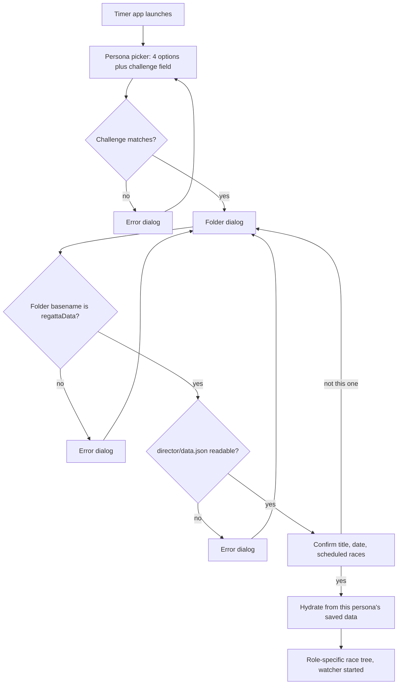

# Persona Implementation Plan

Implementation plan for the persona feature described in [persona.md](persona.md).

## 1. Decisions made up front

These answers shape everything below.

- **Sharing model: configurable between OneDrive and local SMB.** The preferred race-day path is a spare Windows PC on the venue LAN that shares `regattaData` over SMB and also runs a local NTP service. OneDrive remains a supported fallback when course-wide networking is unavailable. The app treats this as a **storage mode** preference (`onedrive` | `smb`), not as two different products — the directory layout and ownership rules are identical; only watcher strategy, conflict detection, and NTP server defaults change. Background on the SMB option lives in [shared-storage-options.md](shared-storage-options.md); the consequences for the implementation are in sections 6 and 12.
- **File granularity: one file per team + persona.** Every file has exactly one writer. Everyone else opens it read-only. There is no lock contention to manage because there is no shared write target.
- **Regatta Director: a separate entry point.** Timers get a binary that cannot reach RD functions at all.

## 2. Two problems the requirements do not mention

Both are load-bearing and should be settled before coding starts.

### 2.1 Clock skew between machines is a correctness bug, not an edge case

The requirement in [persona.md](persona.md) is that the winning time becomes `FT Start click - ST Start Time`. Those two timestamps come from two different laptops. If the ST machine's clock is 3 seconds ahead of the FT machine's, **every race time in the regatta is wrong by 3 seconds**, silently, with no visible symptom. Consumer laptops routinely drift by seconds when they have been asleep or off Wi-Fi.

**Only the cross-machine math is exposed.** Within one machine, lap splits are safe: `getElapsedTime` computes `time.Since(c.clockState.startTime)` where `startTime` came from `time.Now()`, and Go embeds a monotonic reading in both, so `time.Since` is immune to wall-clock jumps. That monotonic reading is stripped the moment a `time.Time` is marshalled to JSON, which is precisely why the ST-to-FT calculation — the only one that crosses a process boundary — is the vulnerable one.

#### Measure the offset; do not set the clock

The instinct is to force a time sync at startup. On Windows that means `w32tm /resync`, and it is the wrong tool here:

- It needs elevation. Setting the system time requires the `SE_SYSTEMTIME_NAME` privilege, so a GUI app would throw a UAC prompt on every launch, and on org-managed devices a standard user often cannot consent to it at all.
- It fails in exactly the conditions we care about. The W32Time service is trigger-start on non-domain Windows and may not be running at all, and on a domain-joined laptop it syncs against the domain controller hierarchy — unreachable from a boathouse on a phone hotspot.
- It destroys the evidence. Setting the clock overwrites the only record of how wrong it was, so a regatta timed with a bad offset can never be corrected afterwards.

Query an NTP server directly from the app instead, in user space, and record the offset without touching the system clock. `github.com/beevik/ntp` is a small pure-Go SNTP client whose `Query` returns `ClockOffset`, `RTT`, and `Stratum` and never modifies system state. It needs no privileges and works identically on Windows and macOS.

This works because **the clocks do not need to be correct, they need to share a time base.** If both machines record `localTime` alongside a measured `offset`, then `trueTime = localTime + offset` and the ST-to-FT difference is accurate even when both system clocks are wrong in different directions.

Design consequences:

- Query at startup and re-query on a ~15 minute ticker, since a laptop waking from sleep can jump. Query two or three servers and take the median to survive one bad responder.
- **Prefer the LAN NTP server when storage mode is `smb`.** The spare Windows PC that hosts the SMB share should also run an NTP service (Windows Time configured as an NTP server, or a lightweight NTP daemon). Point `internal/timesync` at that host first — e.g. `ntp://192.168.x.x` or the share host's hostname — then fall back to public servers (`time.windows.com`, etc.). This is the strongest practical reason to use the spare PC: four laptops synced to the same local reference produce accurate race times even with no internet, because the clocks only need a shared time base.
- **Store the raw local timestamp and the offset as separate fields; never store a pre-corrected time.** Correction is then applied at read time, and a bad offset discovered after the fact can be recomputed away rather than being baked in.
- UDP 123 is commonly blocked on corporate and guest Wi-Fi. When every server fails, record `OffsetSource: "none"` and degrade to detection only: each persona file already carries the writer's wall clock, so a reader can still compare it against its own and raise the skew banner. It cannot correct, but it can warn. Under `smb` mode with a reachable LAN NTP host, this fallback should be rare.
- Optionally offer `w32tm /resync` as an explicitly user-initiated button in the Director's config screen, clearly labelled as requiring admin rights. Never automatic, never at startup.

The remaining mitigations stay as they were:

- Store every timestamp as UTC `RFC3339Nano`.
- Skew over ~1s raises a persistent, dismissible banner naming both machines and the measured offsets.
- Sanity-check the derived winning time. Negative, or outside a plausible race window, means the ST time is bad or stale; suppress the auto-fill and fall back to manual entry.
- **Keep the existing manual `Winning Time` entry as an always-available override.** The referee's official time still wins. The ST-derived value pre-fills the field; it does not replace the field.

### 2.2 Start-time arrival may lag the finish of the race

Under **OneDrive**, the FT will frequently press `Start` before the ST's start time has synced down. Under **SMB**, latency is typically milliseconds and this becomes uncommon — but it still happens if the ST has not yet clicked, or if the LAN briefly drops.

The clock cannot block on a missing start time either way. Design consequence: the winning time is computed **reactively**. The FT clock shows `waiting for start time...`, and when the watcher delivers the ST record, the winning time and every dependent boat time recompute in place. This also means the FT clock must tolerate a start time arriving for a race that is already stopped, and for a race that is already saved but not yet approved.

## 3. Directory layout and ownership

```
<shared root>/regattaData/
```

The shared root is either a OneDrive-synced folder on each laptop or a UNC path such as `\\timing-pc\regatta\regattaData` served by the spare Windows PC. The tree under `regattaData/` is identical in both modes:

```
regattaData/
├── director/
│   └── data.json              # regatta schedule from Excel   [RD writes]
└── timing/
    ├── primary/
    │   ├── start.json         # start times                   [Primary ST writes]
    │   └── finish.json        # race results                  [Primary FT writes]
    └── secondary/
        ├── start.json         # start times                   [Secondary ST writes]
        └── finish.json        # race results                  [Secondary FT writes]
```

Ownership, stated as a rule the code enforces rather than a convention:

- **Regatta Director** writes `director/data.json` and nothing else. Reads everything.
- **Primary/Secondary Start Timer** writes only `timing/<team>/start.json`. Reads `director/data.json`.
- **Primary/Secondary Finish Timer** writes only `timing/<team>/finish.json`, which *is* the race results file. Reads `director/data.json` and `timing/<team>/start.json`.

The Director never writes results. Results are produced by the Finish Timer and written when the FT clicks **Referee Approval** or **Save** — both perform the identical write, per [persona.md](persona.md) lines 60-62. The RD is a consumer of results, not a producer: it reads both teams' `finish.json` to reconcile and export.

Two changes to what exists today:

- `data.json` moves from `regattaData/data.json` to `regattaData/director/data.json`, per the suggestion in [persona.md](persona.md) line 41. The RD startup path performs a one-time migration: if the old path exists and the new one does not, move it.
- **The `results/` directory goes away.** `changeCallBack` in [internal/regatta/config.go](internal/regatta/config.go) currently creates `regattaData/results/` and nothing ever writes to it — lane-image export targets a separately chosen folder. With results living in `timing/<team>/finish.json`, that `CreateDirs` call and the `common.ResultsDir` constant should be removed rather than left as a misleading empty directory in everyone's OneDrive. The directory creation that replaces it is the RD creating `director/`, and each timer creating its own `timing/<team>/` on first write.

## 4. Data model

New package `internal/persona/store` holding the on-disk types and their read/write functions. Keeping them out of `internal/reader` matters — `reader` is about Excel ingestion, and these types are about multi-writer state.

Two notes on the package layout, since `store` sits under `persona`:

- **`persona` must never import `store`.** Nesting in Go is namespacing only and confers no special access, so these are two ordinary packages and the dependency has to run one way: `store` imports `persona` for the `Role` and `Team` types, and `persona` stays a leaf whose path helpers return plain strings. The easy way to break this later is a convenience method like `func (s Session) LoadStart() (*store.StartLog, error)` hung off `Session`; that one line creates an import cycle and Go will reject the build. Loading and saving belong in `store`, taking a `persona.Session` as an argument.
- **Not `internal/persona/internal/store`.** `internal/clock` needs `FinishLog` and `RaceResult` for saving and rehydration, and `internal/regatta` needs `StartLog` for the race tree. A second `internal` would restrict imports to packages rooted at `persona/` and lock both of them out. The outer `internal/` already caps visibility at this module.

```go
// Envelope wraps every persona-owned file. The header fields exist so a reader
// can reject a file written for a different regatta and can estimate the
// writer's clock offset.
type Envelope struct {
	Version    int          // schema version, for forward compatibility
	Role       persona.Role // "start" | "finish"
	Team       persona.Team // "primary" | "secondary"
	RegattaKey string       // hash of regatta Name+Date from director/data.json
	Machine    string       // hostname, for skew and conflict messages
	WrittenAt  time.Time    // writer's wall clock, UTC RFC3339Nano
	Sequence   int          // monotonic per writer; guards against stale reads

	// Clock - the writer's measured offset from NTP at the time of writing.
	// Stored rather than applied so a bad measurement can be corrected later.
	Clock ClockRef
}

type ClockRef struct {
	Offset     time.Duration // add to a local timestamp to get true time
	RTT        time.Duration // round trip of the NTP query, as a confidence bound
	Source     string        // "ntp:time.windows.com", or "none" when unreachable
	MeasuredAt time.Time     // writer's local clock when the offset was measured
}

type StartLog struct {
	Envelope
	Races map[int]StartRecord // keyed by race number
}

type StartRecord struct {
	RaceNumber int
	StartedAt  *time.Time // nil when never recorded, or currently cleared
	Display    string     // "HH:MM:SS.m" as shown in the ST race tree
	Clock      ClockRef   // offset in force when StartedAt was captured

	// Cleared - every start time the ST has discarded for this race, oldest
	// first. This makes clearing non-destructive: a mistaken clear is restored
	// from the last entry, and the list doubles as an audit trail of restarts.
	Cleared []ClearedStart
}

type ClearedStart struct {
	StartedAt time.Time
	Display   string
	Clock     ClockRef  // the offset in force when this value was captured
	ClearedAt time.Time // writer's local clock when the ST cleared it
}

type FinishLog struct {
	Envelope
	Races map[int]RaceResult
}

// RaceResult carries everything needed to rehydrate the clock window exactly as
// the FT left it, which is the requirement in persona.md line 63.
type RaceResult struct {
	RaceNumber int

	// StartedAt - copy of the ST record actually used, with the ST's offset, so
	// the derived winning time can be recomputed or audited later.
	StartedAt      *time.Time
	StartedAtClock ClockRef

	// FirstFinishAt - the FT's Start click, which in this app marks the first
	// boat crossing the finish line rather than the beginning of the race.
	FirstFinishAt      *time.Time
	FirstFinishClock   ClockRef

	WinningTime string   // referee time; auto-filled but user-editable
	Rows        []LapRow // finish-order rows, mirrors clock.laps
	Approved    bool
	ApprovedAt  *time.Time
	UpdatedAt   time.Time
}

type LapRow struct {
	Lane  int    // OOF lane assignment; 0 = unassigned
	Place string // "1".."6" or DQ / DNF / DNS
	Split string
	Time  string
}
```

`LapRow` is deliberately a one-to-one mirror of the existing in-memory `lapRow` in [internal/clock/laps.go](internal/clock/laps.go), so save and restore are straight field copies rather than a translation layer.

### Why the cleared-start history is a slice and not a map

Keyed by the moment of capture, a map would work — `time.Time` implements `TextMarshaler` and `TextUnmarshaler`, so `map[time.Time]T` does round-trip through JSON. The problem is that the feature is inherently ordered. "Restore the time I just cleared by mistake" means *the most recent* entry, and a Go map has no order, so every restore would have to sort the keys first. A slice appended oldest-first gives you `Cleared[len(Cleared)-1]` directly and makes the restart sequence (record, clear, record, clear) readable in the file exactly as it happened.

The key and the value would also be near-duplicates: for a start time, the moment of capture *is* the value. `ClearedAt` is the genuinely new piece of information, so it belongs as a field rather than a key.

Cap the slice at ten entries per race. A race restarting more than a handful of times is not a scenario worth unbounded file growth.

### A correction this exposed: `ClockRef` belongs on the record, not only the envelope

Adding a per-entry `Clock` to `ClearedStart` surfaced a bug in the earlier design. `Envelope.Clock` describes the offset measured at *write* time, but `internal/timesync` re-queries every fifteen minutes and the file is rewritten on every change, so by the time a start time is read back the envelope's offset may no longer be the one that was in force when the value was captured. Each captured timestamp therefore carries its own `ClockRef`. The envelope keeps its copy for diagnostics — it is what the skew banner compares against — but correctness comes from the per-record value.

### On the "as performant as possible" requirement

Keep JSON. At regatta scale — on the order of 100 races — a `finish.json` is tens of kilobytes and marshals in microseconds. Under OneDrive the cost that actually matters is sync propagation measured in seconds; under SMB it is network RTT. Either way, switching to gob or protobuf would optimize the wrong end while giving up the ability to inspect and hand-repair a file mid-regatta. What *does* matter for the watching goroutine is not re-parsing unnecessarily, which section 6 handles with a content-hash short circuit.

## 5. Safe writing

Add to [internal/filesystem/file.go](internal/filesystem/file.go):

```go
// SaveJSONFileAtomic writes to a sibling temp file, fsyncs, then renames over
// the target. A reader mid-update sees either the old file or the new one, never
// a half-written one. The rename is retried: on Windows, OneDrive, Defender, and
// SMB clients all take transient handles on files they have just noticed change.
func SaveJSONFileAtomic(data any, filename string) error
```

Sequence: marshal, write `<dir>/<name>.tmp`, `Sync()`, `Close()`, `os.Rename` over the target. The temp file is a sibling because rename is only atomic within one filesystem; it is short-lived, and the watcher ignores any filename that is not an exact expected match. Prefer UNC paths (`\\host\share\...`) over mapped drive letters for SMB — drive letters are per-user and often fail to reconnect after sleep.

**The rename needs a retry loop in both storage modes.** `os.Rename` on Windows is `MoveFileEx` with `MOVEFILE_REPLACE_EXISTING`. Under OneDrive it fails when the sync engine is mid-upload; under SMB it fails when another client or Defender holds a handle. Both surface as `ERROR_SHARING_VIOLATION` (32) or `ERROR_ACCESS_DENIED` (5). Treat both as retryable — roughly five attempts with backoff from 50ms — and only surface an error after they are exhausted.

**Conflict copies are OneDrive-specific.** OneDrive resolves simultaneous writes by appending the computer name, producing `start-DESKTOP-A1B2C3.json` alongside `start.json`. SMB produces a sharing violation instead of a duplicate file. Conflict-copy *detection* therefore runs only in `onedrive` mode. The single-writer-per-file model still applies in both modes — it is what makes simultaneous writes an operational error rather than a merge problem.

## 6. The watcher

New package `internal/watcher`. The directory layout and event shape are the same for both storage modes; the **detection strategy** is selected by configuration.

```go
type Mode string

const (
	ModeOneDrive Mode = "onedrive" // poll with stat-then-hash
	ModeSMB      Mode = "smb"      // prefer notify; fall back to poll
)

type Event struct {
	Path string
	Data []byte
}

func New(mode Mode, interval time.Duration) *Watcher
func (w *Watcher) Add(path string)
func (w *Watcher) Start(ctx context.Context) <-chan Event
func (w *Watcher) Stop()
```

### Strategy by storage mode

| Mode | Default strategy | Why |
|------|------------------|-----|
| `onedrive` | Poll (~2s), stat-then-hash | OneDrive applies remote changes through staging and Files On-Demand; fsnotify either misses content changes or fires on hydration noise. |
| `smb` | Prefer `fsnotify` (`ReadDirectoryChangesW` over SMB2), fall back to poll | SMB2 can push change notifications and bypasses the Windows SMB client metadata cache that would otherwise make a fast poll see stale `ModTime` for ~10s. |

The watcher interface is one package; mode selects the backend. Poll remains the universal fallback if notify fails to start or the path is not a real SMB share.

### Polling details (required for OneDrive, fallback for SMB)

Per watched file: `os.Stat`, compare `ModTime` and `Size` against the last observation; only if those differ, read the file and compare a SHA-256 of the contents; only if the hash differs, unmarshal and emit.

- **Compare `ModTime` for inequality, not for ordering.** OneDrive preserves the writing machine's modification timestamp, so an update can arrive with an *older* mtime. Under SMB this is less common but the same rule is safe.
- **`os.Stat` is safe on a OneDrive Files On-Demand placeholder; `os.ReadFile` is not.** Reading a dehydrated placeholder triggers hydration. Guard against overlapping ticks; treat read failure as "no change" plus a warning.
- **Ignore anything that is not an exact expected filename** — our `.tmp` files, OneDrive conflict copies, and `desktop.ini`.

### SMB-specific detail

The Windows SMB client caches directory metadata (`FileInfoCacheLifetime` / `DirectoryCacheLifetime`, default ~10s). A poller faster than that cache can miss updates. Prefer notify under `smb` mode rather than asking every laptop to zero those registry values. If notify is unavailable, use a poll interval at least as long as the cache lifetime, still with the hash check as source of truth.

### UI delivery

Delivery into the UI goes through `fyne.Do`, matching the pattern the clock goroutine already uses:

```117:140:internal/clock/clock.go
// startClockUpdate - go routine which displays a running clock once the start button
// is pushed.
func (c *Clock) startClockUpdate() {
	ticker := time.NewTicker(100 * time.Millisecond) // Update every 0.1 seconds
	defer ticker.Stop()

	for {
		select {
		case <-ticker.C:
			if c.clockState.isRunning {
				formatted := c.getElapsedTime()
				// Use fyne.Do to update UI on the main thread
				fyne.Do(func() {
					if c.clock != nil { // Add nil check for safety
						c.clock.Text = formatted
						c.clock.Refresh()
					}
				})
			}
		case <-c.clockState.stopChan:
			return
		}
	}
}
```

The watcher's lifetime is the app session, not a window, so it takes a `context.Context` cancelled at shutdown rather than the clock's `stopChan` pattern.

## 6b. Storage mode configuration

Add a Fyne preference (and a control on the Director/timer config screen) for the shared-storage mode:

| Preference | Values | Effect |
|------------|--------|--------|
| `PrefStorageMode` | `onedrive` (default) / `smb` | Selects watcher backend and whether conflict-copy scanning runs |
| `PrefNTPServers` | comma-separated hosts | Overrides the default NTP list; under `smb`, seed with the share host so LAN NTP is tried first |

The folder dialog and path validation stay mode-agnostic: the user still picks (or pastes) the `regattaData` root, whether that is a OneDrive path or a UNC path. Mode is about *how the app watches and syncs time*, not about where the files live on disk.

Recommended race-day setup for the spare PC (documented in README, not enforced by code):

1. Share a folder over SMB (prefer UNC: `\\timing-pc\regatta\regattaData`).
2. Pin/keep the share host awake; do not rely on a mapped drive letter on timer laptops.
3. Enable NTP on that PC and put its address in `PrefNTPServers`.
4. Optionally one-way backup the share to OneDrive from the host PC for off-site recovery — never bidirectional into the live tree mid-regatta.

## 7. The persona registry

New package `internal/persona`. The registry is a single slice so that "future personas can easily be added later" ([persona.md](persona.md) line 7) means appending one struct literal.

```go
type Role string
type Team string

const (
	RoleDirector Role = "director"
	RoleStart    Role = "start"
	RoleFinish   Role = "finish"

	TeamNone      Team = ""
	TeamPrimary   Team = "primary"
	TeamSecondary Team = "secondary"
)

type Definition struct {
	ID        string // "pst", "sst", "pft", "sft"
	Role      Role
	Team      Team
	Label     string // "Primary Start Timer"
	Challenge string // "rc-pst"
	File      string // "start.json"
}

// Registry - personas offered on the timer startup screen, in display order.
var Registry = []Definition{
	{ID: "pst", Role: RoleStart, Team: TeamPrimary, Label: "Primary Start Timer", Challenge: "rc-pst", File: "start.json"},
	{ID: "sst", Role: RoleStart, Team: TeamSecondary, Label: "Secondary Start Timer", Challenge: "rc-sst", File: "start.json"},
	{ID: "pft", Role: RoleFinish, Team: TeamPrimary, Label: "Primary Finish Timer", Challenge: "rc-pft", File: "finish.json"},
	{ID: "sft", Role: RoleFinish, Team: TeamSecondary, Label: "Secondary Finish Timer", Challenge: "rc-sft", File: "finish.json"},
}
```

Challenge codes are constants in source, which [persona.md](persona.md) line 26 explicitly permits for now. Comparison is trimmed and case-insensitive.

A `Session` value is created once at startup and threaded through `Regatta` and `Clock` instead of being consulted from globals:

```go
type Session struct {
	Definition
	Root string // absolute path to the chosen regattaData directory
}

func (s Session) WritePath() string  // regattaData/timing/<team>/<file>
func (s Session) StartPath() string  // regattaData/timing/<team>/start.json
func (s Session) DataPath() string   // regattaData/director/data.json
```

## 8. Startup flow



### Restoring a persona's view on restart

**Every timer persona hydrates its race tree from what is already saved in `regattaData` before the tree is first shown.** A Start Timer who has to restart the app mid-regatta comes back to every start time they had already collected; a Finish Timer comes back to the start times the ST has recorded *and* to their own saved results. Nothing collected before the restart is lost from view, and nothing has to be re-entered.

What each persona reads at this point:

- **Start Timer** reads its own `timing/<team>/start.json`. Every race with a `StartedAt` shows its time; every race with a non-empty `Cleared` history shows the `Restore` button.
- **Finish Timer** reads both `timing/<team>/start.json`, for the start-time value on each row, and its own `timing/<team>/finish.json`, for the races it has already timed. Combined with the per-race clock rehydration in section 9, reopening any race returns the FT to exactly the state they left it.
- **Director** reads `director/data.json` plus all four timing files, as described in section 9.

**Hydration and the watcher share one code path.** The initial load is nothing more than "apply the current contents of these files through the same row-update function the watcher calls." Writing a separate startup render would give two code paths that have to agree about how a race row looks, and they would eventually drift.

Four things this load has to get right:

- **Reject data from a different regatta.** A timer who used the app at last weekend's regatta still has a `start.json` on disk. The `Envelope.RegattaKey` is compared against the regatta in `director/data.json`, and on a mismatch the file is not hydrated and not overwritten — it is renamed aside with a timestamp and the persona starts clean, with an explanation. Silently showing last week's times against this week's races is the kind of error nobody catches until results are published.
- **Resume the sequence counter.** `Envelope.Sequence` continues from the value in the file rather than restarting at zero, or the stale-read guard stops working for the rest of the day.
- **A missing file is normal, not an error.** First launch at a given regatta has nothing to restore. This matches how `initRegatta` already treats `fs.ErrNotExist` today.
- **Never overwrite a file that failed to parse.** This is the one that can lose a day's work. If the persona's own file exists but does not unmarshal, the app must not fall back to an empty in-memory state and then write it out on the next Start Time click. Treat a parse failure as fatal for that persona: report it, copy the file aside for recovery, and require the user to acknowledge before any write is permitted.

Three notes on fidelity to the requirements:

- **"They should only be able to select a directory that matches regattaData before they can click Open"** ([persona.md](persona.md) line 30). Fyne's `ShowFolderOpen` has no filter hook and no way to conditionally disable its Open button, so this is implemented as validate-in-callback plus immediate re-prompt with an explanatory error. Behaviourally equivalent, one extra click in the failure case. Flagging it because it is a deliberate deviation from the literal wording.
- **The folder name alone is not a reliable check.** Under OneDrive for Business, timers add the shared folder with "Add shortcut to My files" and can rename it. Under SMB, the share may be mounted or browsed under any leaf name. Validate on *either* a basename of `regattaData` or the presence of a readable `director/data.json` inside the selected folder, and accept the folder if either holds. Accept UNC paths. The confirmation dialog in the next step is the real safeguard against picking the wrong regatta.
- **Preferences no longer drive startup.** `initRegatta` currently restores the last session from `PrefRegattaDir`:

```130:150:internal/regatta/regatta.go
func (r *Regatta) initRegatta() {

	if r.App.Preferences().String(common.PrefRegattaDir) == common.EmptyString {
		r.showWelcome()
		return
	}

	if err := r.loadRegattaData(); err != nil {
		// A missing file is the normal first run for a configured directory: the
		// user has chosen where their data lives but has not imported a regatta.
		if !errors.Is(err, fs.ErrNotExist) {
			r.warnOnStarted(err)
		}
		r.loadState.loadButton.Enable()
		r.showWelcome()
		return
	}

	r.refreshContent()
	r.showRaceTree()
}
```

  For the timer binary this is replaced entirely by the persona flow. `PrefRegattaDir` is no longer read to auto-load; at most it seeds the folder dialog's starting location as a convenience. The RD binary keeps it, since the RD is the persona that "establishes the regattaData save location".
- **`setupStartupDialog` at [internal/regatta/regatta.go](internal/regatta/regatta.go) lines 103-128 is dead code** and should be deleted as part of this work rather than carried forward.

### Regatta Director entry point

A second binary, `cmd/regattaDirector/main.go`, sharing `internal/regatta` via a mode flag on construction (`NewDirector` / `NewTimer`). The timer binary contains no path to the Excel loader, so timers cannot reach RD functions even accidentally. [.github/workflows/release.yml](.github/workflows/release.yml) gains parallel `fyne package -src ./cmd/regattaDirector/` steps for macOS and Windows.

Lower-effort alternative if two distributables prove annoying: one binary with a `--director` flag. Same code structure, weaker separation.

## 9. UI changes by role

### Race tree

The current row is title, spacer, `Time Race` button:

```81:98:internal/regatta/races.go
func (r *Regatta) timeButton(race reader.RaceData) *widget.Button {
	// Create a button to time this race
	return widget.NewButton(common.TimeRaceButtonText, func(raceData reader.RaceData) func() {
		return func() {
			clockApp := clock.NewClock(r.App, r.RegattaData, raceData)
			clockApp.OpenRaceClock()

		}
	}(race))
}

func (r *Regatta) raceEntry(race reader.RaceData) *fyne.Container {
	return container.NewHBox(
		widget.NewLabel(race.RaceTitle()),
		layout.NewSpacer(),
		r.timeButton(race),
	)
}
```

It becomes role-driven:

- **Start Timer**: title, start-time label, `Start Time` button, `Clear` button, and a `Restore` button. No `Time Race` button. `Clear` still prompts for confirmation ([persona.md](persona.md) line 50), and recording, clearing, and restoring each write `start.json` immediately.

  **Clearing is non-destructive.** Rather than wiping the value, `Clear` appends it to that race's `Cleared` history and sets `StartedAt` to nil. `Restore` pops the most recent entry back into `StartedAt`, along with the `ClockRef` that was in force when it was originally captured — restoring the value without its original offset would reintroduce exactly the skew error section 2.1 exists to prevent.

  `Restore` is visible only when the race has a non-empty `Cleared` history. In the common case — the ST clears by mistake and the row goes blank — it simply appears next to `Start Time`, needing no menu. If a new time has since been recorded, restoring would overwrite good data, so that case prompts for confirmation the way `Clear` does.

  This changes nothing for the Finish Timer, which reads only `StartedAt` and recomputes reactively when the watcher reports the change. A clear followed by a restore looks to the FT like any other update.
- **Finish Timer**: title, start-time label (read-only, watcher-updated), an indicator of the FT's own saved progress for that race, and the `Time Race` button. No `Start Time` button.

  The progress indicator exists so the restart case in section 8 actually restores something visible: an FT returning after a crash needs to see at a glance which races they have already timed and approved, not just which ones have start times. It reads `WinningTime` and `Approved` from their own `finish.json`.
- **Director**: read-only. No buttons on any row. Each row carries the race title plus four values that together show how far the regatta has progressed: **Restarts**, **Start Time**, **Winning Time**, and an **approval indicator**.

  Sources are `len(StartRecord.Cleared)` for restarts, `StartRecord.Display` for the start time, and `RaceResult.WinningTime` and `RaceResult.Approved` from the finish log.

  **Primary team first, falling back to secondary per value.** The fallback is per value rather than per row, because the failure modes are independent: the primary ST can be recording while the primary FT's machine is offline, which should show a primary start time next to a secondary winning time rather than dropping the whole row to secondary. Any value sourced from the secondary team is marked as such — an RD who reads a secondary time as though it were primary has been given worse information than a blank cell.

  This makes the Director the one person who can see the regatta stalling, so it is where the staleness indicator and the clock-skew banner from section 2.1 matter most.

  Two consequences worth noting. The RD no longer times races at all — dropping the row buttons removes the `Time Race` path from the Director, leaving Excel import and lane-image export in the menus as its only actions. And **the Director now needs the watcher**, which the earlier draft scoped to timers only; it watches all four timing files, since per-value fallback requires the secondary team's data even when the primary is healthy.

`showRaceTree` currently rebuilds the entire window content. Rebuilding on every watcher tick would throw away the user's scroll position mid-regatta, so the tree keeps a `map[int]*raceRow` of per-race widget handles and updates the affected labels in place inside `fyne.Do`.

### Finish Timer clock

Three changes to [internal/clock](internal/clock):

1. **Auto-filled winning time.** On `Start`, look up the ST record for this race. If present and sane, pre-fill `winningTime` with `ClockStart - StartedAt` and mark it as derived; the field stays editable. If absent, show `waiting for start time...` and recompute when the watcher delivers it. The existing `Time = Split + WinningTime` math in `adjustTime` is unchanged — only the source of `WinningTime` changes.
2. **Save on approve and on Save.** `refereeApprovalFunc` currently only flips an in-memory flag, and `initSave` is a stub that does nothing:

```181:189:internal/clock/buttons.go
func (c *Clock) initSave() *widget.Button {
	button := widget.NewButton(common.SaveButtonText, func() {
		// Save logic will be implemented later
	})
	button.Disable()
	return button
}
```

   Both now serialize the lap rows into a `RaceResult` and atomically rewrite `finish.json`, per [persona.md](persona.md) lines 60-62.
3. **Rehydration.** `NewClock` checks `finish.json` for an existing `RaceResult` for this race number and, if found, restores lap rows, OOF assignments, place overrides, winning time, and button enablement before showing the window ([persona.md](persona.md) line 63).

## 10. Suggested phasing

Each phase compiles, passes tests, and leaves the app usable.

0. **Windows CI first.** Add the `windows-latest` job to [.github/workflows/test.yml](.github/workflows/test.yml) before anything else, so that every phase after it is verified on the platform it will actually run on.
1. **Foundations** — `SaveJSONFileAtomic` with its retry loop, hash helper, `sanitizeForFilename`. No UI change.
1b. **`internal/timesync`** — SNTP offset measurement via `github.com/beevik/ntp`, configurable server list (LAN NTP first under `smb` mode), median of several servers, background re-query, and a `Now()` returning the corrected time plus its `ClockRef`.
2. **Persona registry** — `internal/persona` with the registry, challenge check, and path helpers. Pure logic, fully unit-testable.
3. **Layout and store types** — `internal/persona/store` types, read/write functions, `director/data.json` migration.
4. **Watcher** — `internal/watcher` with mode-selected backends (`onedrive` poll vs `smb` notify-with-poll-fallback), conflict-copy detection only in OneDrive mode.
4b. **Storage mode preferences** — `PrefStorageMode` and `PrefNTPServers` on the config screen; wire them into watcher construction and timesync.
5. **Timer startup flow** — picker, challenge, directory validation, confirmation, hydration. Delete `setupStartupDialog`.
6. **Role-aware race tree** — Start Time / Clear / Restore for ST, progress indicators for FT and RD, in-place watcher refresh.
7. **Clock integration** — derived winning time, save on approve/save, rehydration, skew warnings.
8. **Director binary** — `cmd/regattaDirector`, its read-only progress tree wired to the watcher over all four timing files, release packaging, and primary-vs-secondary reconciliation for export.

## 11. Testing

The existing suites in `internal/regatta` and `internal/clock` already construct real Fyne test apps, so the new work fits the same pattern.

- **Registry** — every persona has a unique challenge and a unique write path; challenge matching is case- and whitespace-insensitive.
- **Atomic write** — concurrent reader never observes partial content; rename replaces an existing file on the host platform; and, in a Windows-only test, a rename whose target is held open by another handle succeeds once that handle closes rather than failing on the first attempt.
- **Filename sanitization** — regatta names containing Windows-reserved characters and reserved device names produce writable paths.
- **Clear and restore** — a record, clear, record, clear sequence leaves the history in capture order; `Restore` returns the most recently cleared value *and* its original `ClockRef` rather than the current one; the history caps at ten entries by dropping the oldest; and restoring onto a race that already has a start time requires confirmation.
- **Director progress tree** — restarts reflect `len(Cleared)`; a race present only in the secondary team's data falls back and is marked as secondary-sourced; and fallback is per value, so a primary start time and a secondary winning time can appear on the same row.
- **Skew and winning time** — derived winning time is correct for aligned clocks, and suppressed with a warning for negative or implausible values.
- **Watcher** — a file rewritten with identical content emits nothing; changed content emits once; mtime granularity does not cause missed updates; a replacement file stamped with an *older* mtime is still detected (OneDrive case); and under `smb` mode the notify backend delivers an update that a short-interval poll alone would miss behind a warm SMB metadata cache.
- **Storage mode** — switching `PrefStorageMode` selects the watcher backend; conflict-copy scanning runs only for `onedrive`; `PrefNTPServers` seeds timesync with the LAN host under `smb`.
- **Time sync** — two synthetic personas with system clocks offset in opposite directions produce the correct winning time once their recorded offsets are applied. An unreachable NTP server yields `Source: "none"` and a warning. A configured LAN NTP server is preferred over public servers when present.
- **Round trip** — a fully timed race saved to `finish.json` and rehydrated into a fresh clock reproduces every lap row, place override, and OOF assignment.
- **Startup flow** — wrong challenge returns to the picker; a directory not named `regattaData` is rejected; declining the confirmation returns to the folder dialog.
- **Restart restores the view** — an ST with saved start times and cleared history sees both after a restart; an FT sees the ST's times plus its own approvals; a `start.json` whose `RegattaKey` belongs to another regatta is set aside rather than displayed; `Sequence` resumes from the file rather than resetting; and a persona file that fails to unmarshal blocks writes instead of being silently replaced with an empty one.

## 12. Windows storage modes: OneDrive and local SMB

The app supports both. Prefer the spare Windows PC (SMB + LAN NTP) when the venue network reaches start and finish; keep OneDrive as the fallback. Detailed trade-offs are in [shared-storage-options.md](shared-storage-options.md).

### Mode-specific behaviour (already covered above)

| Concern | OneDrive (`onedrive`) | Local SMB (`smb`) |
|---------|----------------------|-------------------|
| Watcher | Poll, stat-then-hash | Prefer fsnotify; poll as fallback |
| Conflict copies | Detect `start-DESKTOP-….json` | Not applicable; sharing violations instead |
| NTP default | Public servers | Share host first, then public |
| Path form | Local OneDrive path | Prefer UNC `\\host\share\…` |
| Failure mode if link drops | Isolated but writable (local mirror) | Shared path unreachable until LAN returns |

### New code work (both modes)

- **Add a Windows CI job.** [.github/workflows/test.yml](.github/workflows/test.yml) is Ubuntu-only today. Add `windows-latest` running `go test ./internal/...`.
- **Sanitize filenames.** Route exporter and persona-derived paths through `sanitizeForFilename` for Windows-reserved characters and device names.
- **Staleness indicator in the race tree.** Surface "start times last updated Ns ago" from the watcher's last-change time. Under OneDrive this catches paused sync; under SMB it catches a dead share or a sleeping host PC.
- **`PrefStorageMode` / `PrefNTPServers`** on the config UI (section 6b).

### Operating requirements for race day

**SMB (preferred when LAN covers the course):**

- Host PC stays awake and shares the folder; timers use the UNC path, not a flaky mapped drive.
- Enable NTP on the host and configure it in the app.
- Confirm start-line and finish-line laptops can both reach the share before first race (course geometry is the hard part — see [shared-storage-options.md](shared-storage-options.md)).
- Optional: one-way backup from the host to OneDrive for off-site recovery; never bidirectional into the live tree during racing.

**OneDrive (fallback):**

- Pin `regattaData` ("Always keep on this device").
- Turn off pause-on-metered-connection.
- Assume sync will stall at some point; the manual `Winning Time` entry and secondary team remain the safety net.

## 13. Open items

- **Cross-team fallback.** If the primary ST never records a start time, should the primary FT be able to fall back to the secondary team's `start.json`? Useful in practice, but it silently crosses the primary/secondary boundary, so it likely needs an explicit user confirmation rather than an automatic fallback.
- **Reconciliation.** When both teams time the same regatta, the RD needs a way to compare primary and secondary results and choose the authoritative set before export. Scoped into phase 8, but the UI for it is undesigned.
- **Challenge codes in source.** Fine for now per the requirements. If the codes ever need to change without a release, they move to a file the RD writes into `regattaData/director/`, which stays consistent with the one-writer-per-file rule.
- **Local write-ahead journal.** [shared-storage-options.md](shared-storage-options.md) recommends journaling collected values locally before writing to the shared path, so an SMB outage (or OneDrive stall) does not block collection. Valuable for both modes; not required for the first ship of personas.
